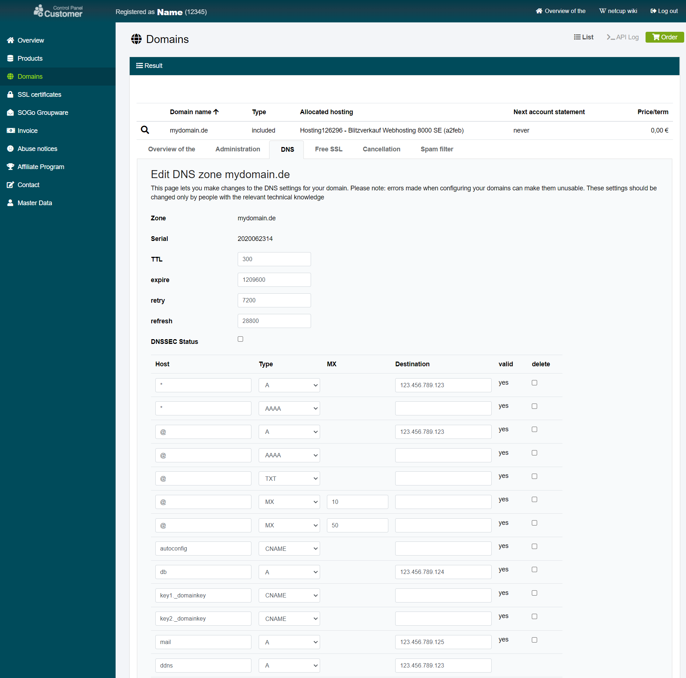
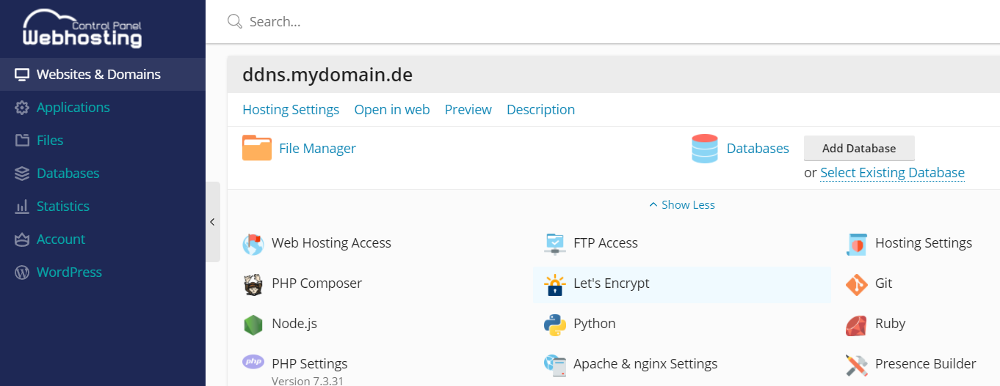
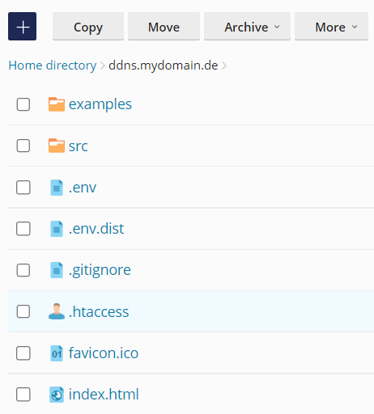
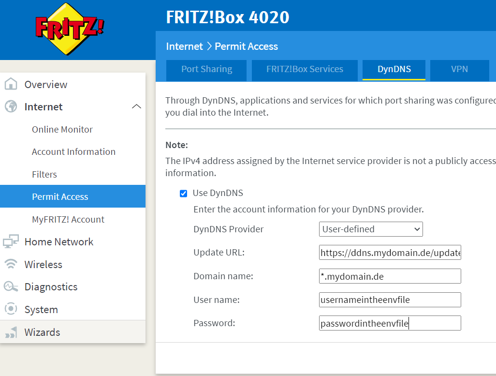

# Introduction

This tutorial shows you how to set up a DynDNS for a connected domain using a webhosting plan from netcup. With DDNS, you can, for example, link a domain to your home network even if the IP address changes daily.

# Requirements

- Any webhosting plan from netcup
- A domain connected to the webhosting
- A device in the target network that can periodically call a URL with the current IP address (for example, a router such as Fritz!Box or any other device that can execute a bash script). PHP support by this device is not necessary.

# Step 1 - Activate netcup API

After creating a webhosting plan with a domain, the API must be activated in the Customer Control Panel (CCP). You will need an API key and an API password. You can generate these under "Master Data --> API":


Please store the API key somewhere, as you are going to need it later.

# Step 2 - Add a new DNS record to the domain

The second step is to add a new DNS record to the domain, which will be used as the update URL. In the "Domains" settings, select the domain and then switch to the "DNS" settings.

First, you can optionally set the TTL to a smaller number like 300 to update the domain faster. Then you add a new record with the standard destination of the webhosting product. You can freely choose the name of the host. In my example, I used "ddns":



As you can see in your "Products" menu under this domain, the IP address must always be the same:


# Step 3 - Test the DNS settings

At this point, you should check whether the DNS settings for the subdomain have been applied if the subdomain was previously routed to a different IP address. This can sometimes take a few hours.

You can run this test with any terminal on your device using this command:
`ping -4 ddns.mydomain.com`

The output should look something like this:

```bash
Ping is executed for ddns.mydomain.com [123.456.789.123] with 32 bytes data:
Answer from 123.456.789.123: Bytes=32 Time=27ms TTL=59
Answer from 123.456.789.123: Bytes=32 Time=25ms TTL=59
[...]
```

# Step 4 - Create a subdomain in Plesk

When the IP address matches the one in the CCP, it is time to switch to Plesk. You can open Plesk through the products menu:


There you can add a new subdomain:


Choose the same hostname as before and the correct domain:


In the settings of the new subdomain, you can add an SSL certificate with Let's Encrypt:



When you now visit your subdomain with a web browser, you should see the default text "The website is under construction". If not, make sure that the document root is the one where the default index.html is located. Also check once more that the correct IP address from the previous step is used.

# Step 5 - Add script to subdomain

[Felix Kretschmer](https://github.com/fernwerker "Github Account of Fernwerker") wrote a:

> Self-hosted dynamic DNS php script to update netcup DNS API from Router like AVM FRITZ!Box

You have to [download](https://github.com/fernwerker/ownDynDNS) the script.


After unzipping, you can upload the whole direction into the subdomain's document root with the file manager. Change "htaccess.example" to "htaccess". Afterwards, you must fill in the correct credentials in the ".env.dist" file and save the file as ".env". You can choose anything as username and password. This is _not_ your netcup username and password. Your file manager should look something like this:



Try to navigate to ddns.mydomain.com/.env with a web browser.
You should see error 403 (forbidden). If you can see the environment file, you should immediately update the .htaccess file and include the .env in it:

```text
<Files .env>
    Order allow,deny
    Deny from all
</Files>
```

Now navigate to ddns.mydomain.com/update.php with a web browser.
You should see an error:

```php
Fatal error: Uncaught RuntimeException: payload invalid in /var/www/vhosts/hosting123456.a2feb.netcup.net/ddns.mydomain.com/src/Handler.php:35
Stack trace:
#0 /var/www/vhosts/hosting123456.a2feb.netcup.net/ddns.mydomain.com/update.php(20): netcup\DNS\API\Handler->__construct(Array, Array)
#1 {main}
  thrown in /var/www/vhosts/hosting123456.a2feb.netcup.net/ddns.mydomain.de/src/Handler.php on line 35
```

This means that so far everything is working as expected.

# Step 6 - Call the URL

The last thing you have to do is to call the setup URL.

`https://ddns.mydomain.de/update.php?user=<username>&password=<pass>&ipv4=<ipaddr>&ipv6=<ip6addr>&domain=<domain>`

If you have a Fritz!Box, you can add username, password and domain to the DynDNS form:



On another device you might have to use the [bash script](https://github.com/fernwerker/ownDynDNS/blob/master/examples/update-dyndns.sh), which is also a way to test the script. You need a device connected to the internet that can execute shell scripts.

Please create a new file named `nano ddns-script.sh` on that device and fill in the code:

```bash
#!/usr/bin/env bash

# you can run this script from **ix bases device to update (different) Records

USER="username as in the .env"
PASS="password as in the .env"
DOMAIN="mydomain.com"
SCRIPT="https://ddns.mydomain.com/update.php"
FORCE=0
MODE="both" # can be undefined, "@", "*" or "both"

IPV4=$(curl -4 -q v4.ident.me)
IPV6=$(curl -6 -q v6.ident.me)

echo ${IPV4}
echo ${IPV6}

# PAYLOAD_IPV4="force=${FORCE}&user=${USER}&password=${PASS}&ipv4=${IPV4}&domain=${DOMAIN}&mode=${MODE}"
# curl -X POST --data "${PAYLOAD_IPV4}" ${SCRIPT}

# PAYLOAD_IPV6="force=${FORCE}&user=${USER}&password=${PASS}&ipv6=${IPV6}&domain=${DOMAIN}&mode=${MODE"}
# curl -X POST --data "${PAYLOAD_IPV6}" ${SCRIPT}

PAYLOAD_BOTH="force=${FORCE}&user=${USER}&password=${PASS}&ipv4=${IPV4}&ipv6=${IPV6}&domain=${DOMAIN}&mode=${MODE}"
curl -X POST --data "${PAYLOAD_BOTH}" ${SCRIPT}
```

After saving, you can execute the `sh ddns-script.sh` script.
The output should look like this:

```php
[DEBUG] api login successful
[DEBUG] IPv4 for @.example.com set to 123.456.123.456
[DEBUG] dns recordset updated
[DEBUG] api logout successful
```

Check the DNS settings in the CCP to verify that the DNS has been updated.

# Conclusion

Running the script updates the DNS setting of the domain. The subdomain set explicitly in the DNS settings remains unchanged.

# License

MIT

# Contributor's Certificate of Origin

By making a contribution to this project, I certify that:

1.  The contribution was created in whole or in part by me and I have the right to submit it under the license indicated in the file; or

2.  The contribution is based upon previous work that, to the best of my knowledge, is covered under an appropriate license and I have the right under that license to submit that work with modifications, whether created in whole or in part by me, under the same license (unless I am permitted to submit under a different license), as indicated in the file; or

3.  The contribution was provided directly to me by some other person who certified (a), (b) or (c) and I have not modified it.

4.  I understand and agree that this project and the contribution are public and that a record of the contribution (including all personal information I submit with it, including my sign-off) is maintained indefinitely and may be redistributed consistent with this project or the license(s) involved.

Signed off by: Jewgeni Lewash (j.lewash@gmail.com)
