# Introduction
Deploying modern JavaScript frameworks like Next.js 15+ can be tricky when working within the limitations of shared web hosting environments — especially when your app includes a custom server.js. In this tutorial, we’ll walk through how to deploy a production-ready Next.js 15 application to Netcup Webhosting, leveraging Node.js support and Netcup’s powerful web interface.

You’ll learn how to prepare your Next.js project, configure your custom server, deploy your code via FTP or SSH, and set up your environment so your app runs smoothly under Netcup’s web hosting infrastructure.

This guide is ideal for developers with a working Next.js 15 app who want to take advantage of Netcup’s affordable and flexible hosting plans — without spinning up a full VPS.

By the end, your app will be live on the internet, served by your very own server.js, and ready for production traffic.

# Requirements
* you have your nextjs app running locally on your node environment
* have a Webhosting account on Netcup
* Remind throughout the complete tutorial, to use your own paths. I intentionally added my schiegl-custom paths in screenshots etc, so that you can understand the connecting-parts easier. 

# Step 1 - Make you base setup right of nextjs
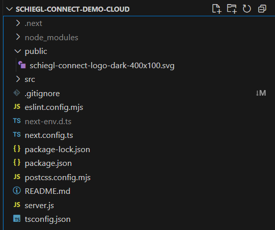

You need an own server.js and NOT the native next.js launcher in node_modules/.bin/next

## 1. Create a server.js:
```javascript
const next = require('next');
const http = require('http');
const os = require('os');

const port = process.env.PORT || 3000;
const app = next({ dev: false }); // Important for production
const handle = app.getRequestHandler();

// Get LAN IP address
function getLocalExternalIP() {
    const interfaces = os.networkInterfaces();
    for (const name of Object.keys(interfaces)) {
        for (const iface of interfaces[name]) {
            if (iface.family === 'IPv4' && !iface.internal) {
                return iface.address;
            }
        }
    }
    return 'localhost';
}

app.prepare().then(() => {
    http.createServer((req, res) => {
        handle(req, res);
    }).listen(port, () => {
        const localURL = `http://localhost:${port}`;
        const lanURL = `http://${getLocalExternalIP()}:${port}`;

        console.log('🚀 Server is running!');
        console.log(`🔗 Local:  \x1b[36m${localURL}\x1b[0m`);
        console.log(`🌐 LAN:    \x1b[36m${lanURL}\x1b[0m`);
        console.log('✅ Ready to serve!');
    });
});
```

## 2. enhance package.json
I needed to change the content of "scripts" to:
```json
"scripts": {
    "start": "cross-env NODE_ENV=production node server.js",
    "build": "next build",
    "dev": "next dev --turbopack",
    "lint": "next lint"
  }
```

## 3. install cross-env
```bash
npm install --save-dev cross-env
```
in order to be able to run 'npm start' from your dev-Windows machine, if you have one AND it works with Phusion (which is the node.js handler at Netcup). 

Test locally to run: 
- on Windows: $env:PORT=4001; npm start
- on Linux: PORT=4001 npm start   (<- not tested, ChatGPT generated)

If it works on your dev-machine, go on.
It should look like that:
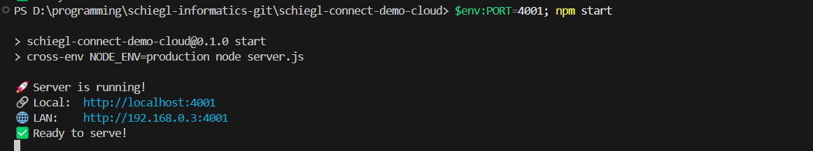

Yes, and test your application, if still everything works 😉 

# Step 2 - Add Subdomain (if needed)
If you need a subdomain, add it now.
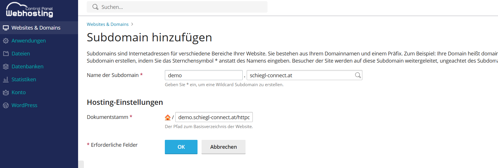
If not, just make sure you have a default-setting for the page we configure now.
You do not need to change the document root, as we delete it anyways.

# Step 3 - Setup SSL and verify Default working
-> with SSL/TLS Certificates for example https://helpcenter.netcup.com/en/wiki/web-hosting/enabling-ssl-tls

Then, you should see at least that:
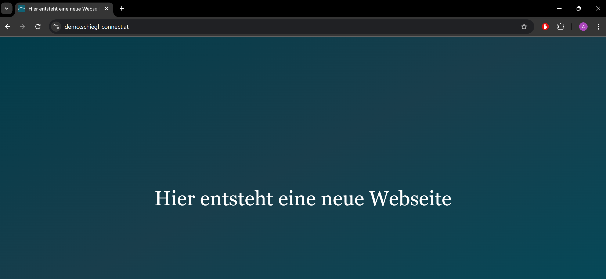

That is the default Apache "Hi". We gonna stop that to make place for node.js. 

# Step 4 - Disable Proxy (Apache Use)
Click:
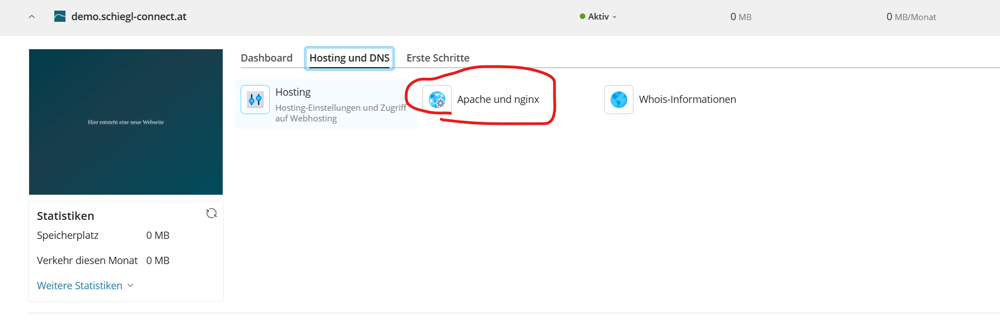

Click:
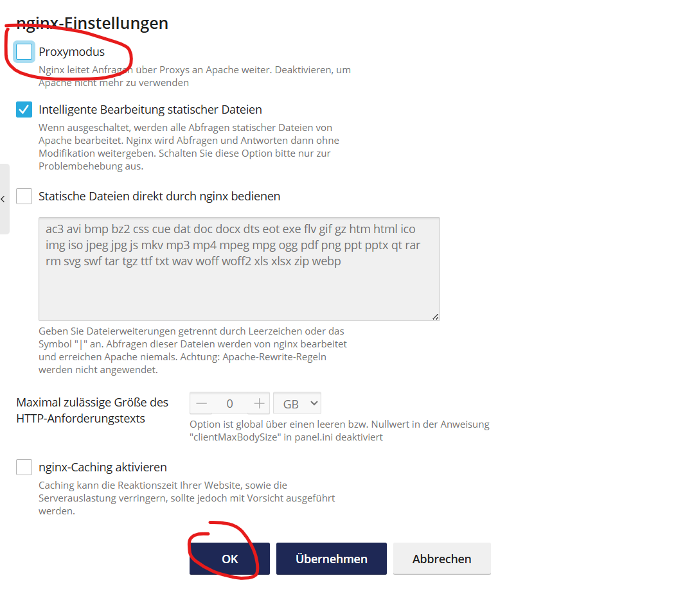

Now, Apache is not bothered anymore and we are ready to setup node.js

# Step 5 - Place your Code on the Webhosting
SSH connect to your server.

It should look like that now:
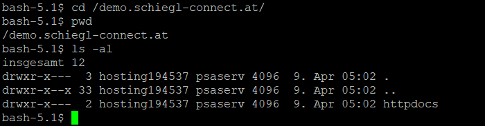

Remove the httpdocs 
```bash
rm -rf httpdocs/
```
and add you code (via git for example, see this screenshot)
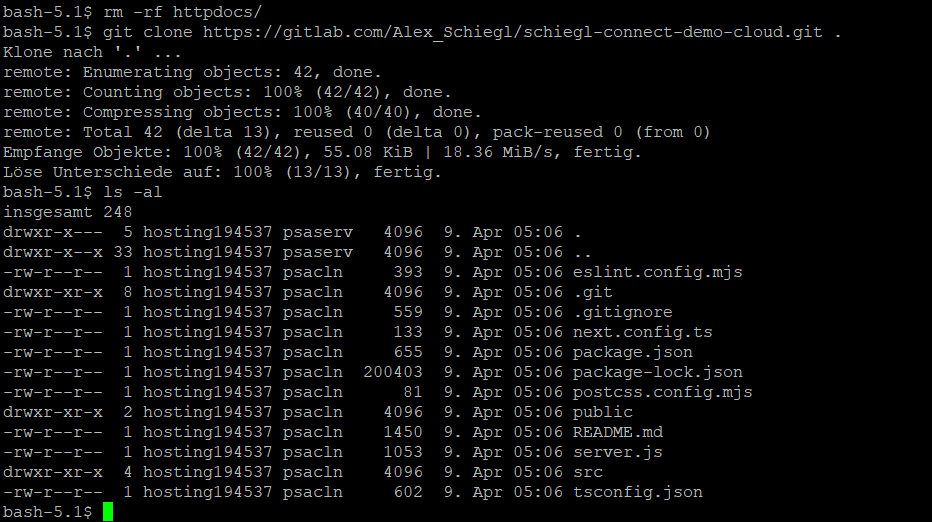
the above screenshot also says you how it should look like. So you see our server.js? Remember, this is in the root /demo.schiegl-connect.at/ located.

# Step 6 - Setup Node.js in Webhosting Plesk Panel in Netcup
Go into Node Config:
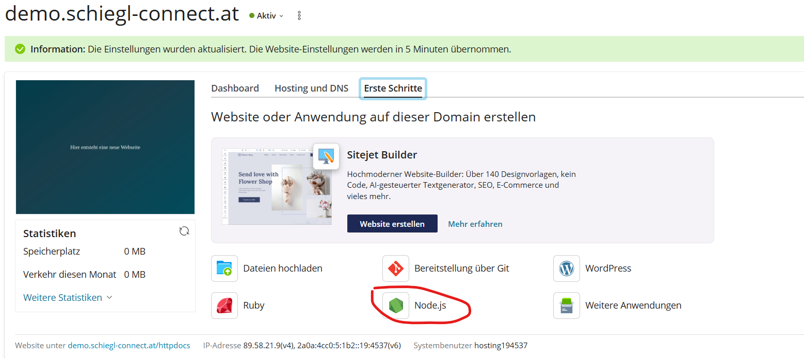

Change the two settings accordingly and active Node.js (the activation takes a little bit):
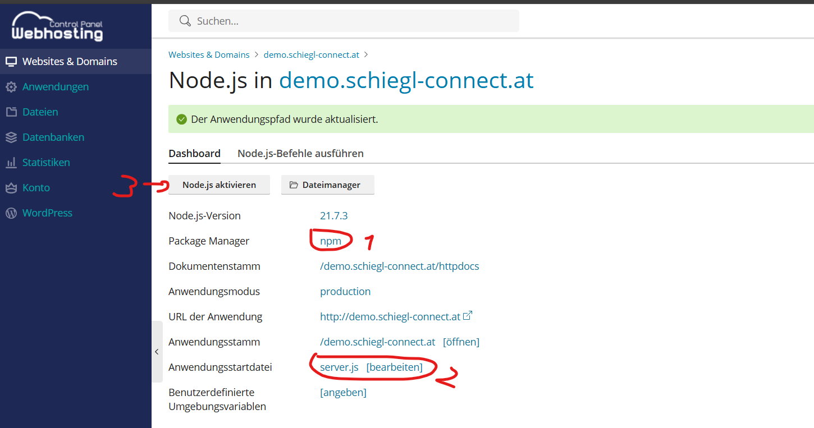

Do a npm install the Plesk way and wait until finished:
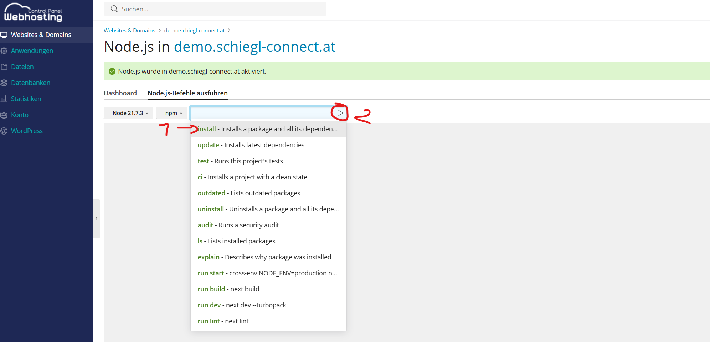

Then do npm run build and wait until finished
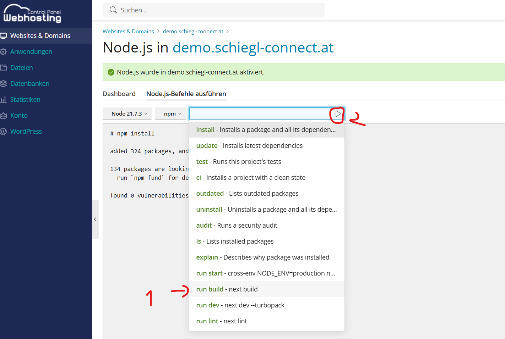

Change the document root to: <your_path>/.next/static (this is only now possible, AFTER the build)
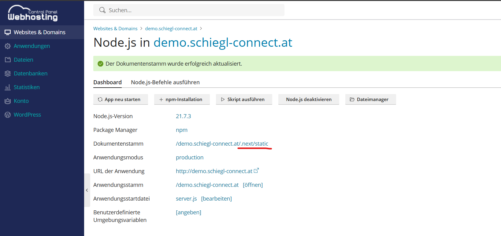

Now do a run start and hope 😊: 
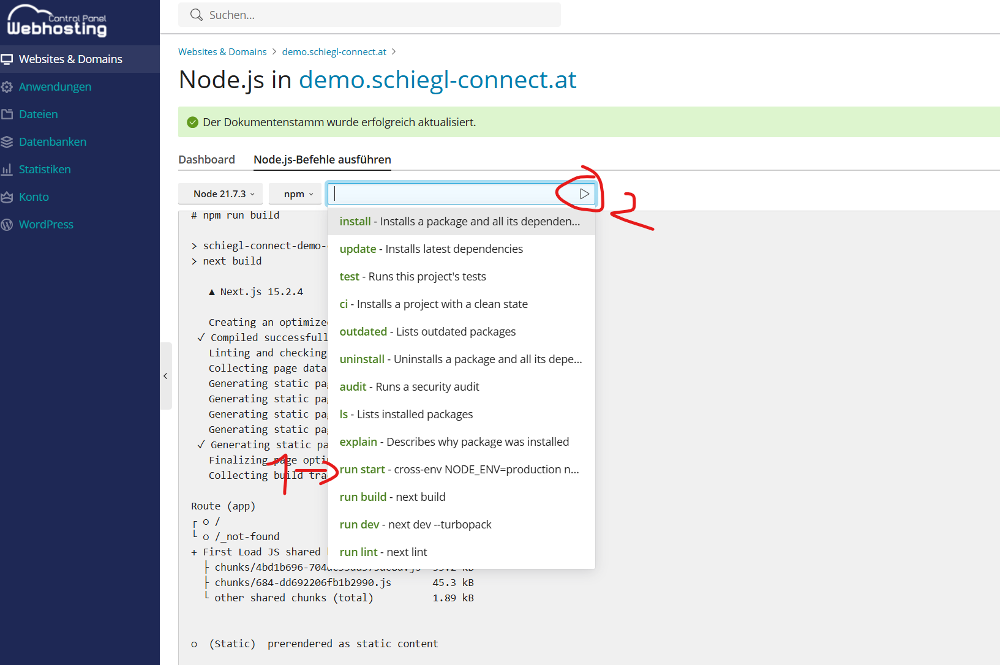

Should look like that:
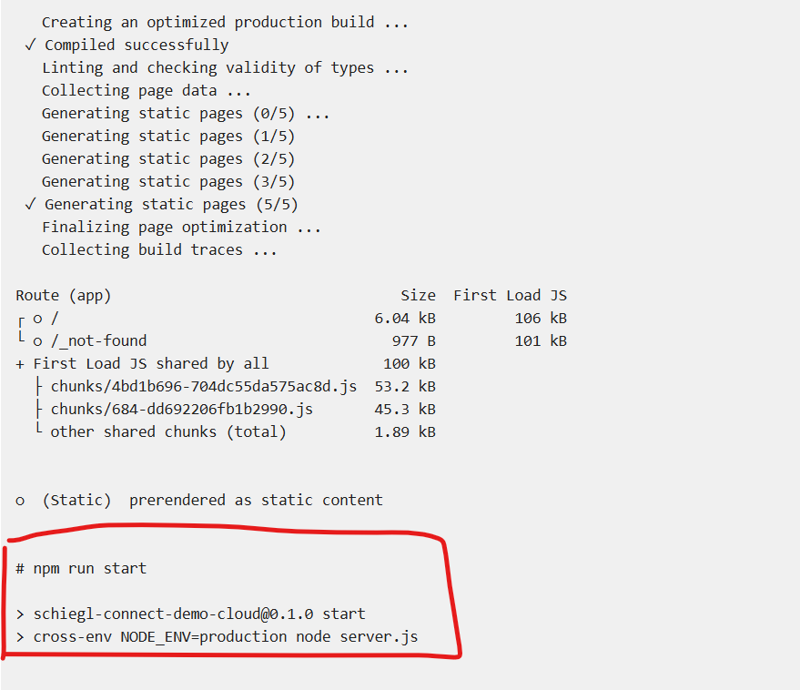

# Conclusion
Yes, works:

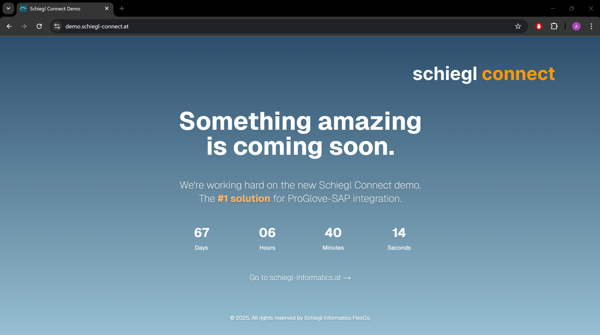

Have a nice day!
Alexander Schiegl
CEO 
Schiegl Informatics FlexCo

# Licence

[MIT](https://github.com/netcup-community/community-tutorials/blob/main/LICENSE)

Copyright (c) 2025 netcup

Permission is hereby granted, free of charge, to any person obtaining a copy of this software and associated documentation files (the "Software"), to deal in the Software without restriction, including without limitation the rights to use, copy, modify, merge, publish, distribute, sublicence, and/or sell copies of the Software, and to permit persons to whom the Software is furnished to do so, subject to the following conditions:

The above copyright notice and this permission notice shall be included in all copies or substantial portions of the Software.

THE SOFTWARE IS PROVIDED "AS IS", WITHOUT WARRANTY OF ANY KIND, EXPRESS OR IMPLIED, INCLUDING BUT NOT LIMITED TO THE WARRANTIES OF MERCHANTABILITY, FITNESS FOR A PARTICULAR PURPOSE AND NONINFRINGEMENT. IN NO EVENT SHALL THE AUTHORS OR COPYRIGHT HOLDERS BE LIABLE FOR ANY CLAIM, DAMAGES OR OTHER LIABILITY, WHETHER IN AN ACTION OF CONTRACT, TORT OR OTHERWISE, ARISING FROM, OUT OF OR IN CONNECTION WITH THE SOFTWARE OR THE USE OR OTHER DEALINGS IN THE SOFTWARE.

# Contributor's Certificate of Origin
By making a contribution to this project, I certify that:

 1) The contribution was created in whole or in part by me and I have the right to submit it under the licence indicated in the file; or

 2) The contribution is based upon previous work that, to the best of my knowledge, is covered under an appropriate licence and I have the right under that licence to submit that work with modifications, whether created in whole or in part by me, under the same licence (unless I am permitted to submit under a different licence), as indicated in the file; or

 3) The contribution was provided directly to me by some other person who certified (a), (b) or (c) and I have not modified it.

 4) I understand and agree that this project and the contribution are public and that a record of the contribution (including all personal information I submit with it, including my sign-off) is maintained indefinitely and may be redistributed consistent with this project or the licence(s) involved.

 5) The trademark rights, including the names schiegl-connect and other trademarks of Schiegl Informatics FlexCo, remain the exclusive property of Schiegl Informatics FlexCo. Their use in this tutorial is solely for educational and illustrative purposes, and does not imply any affiliation, endorsement, or transfer of rights.
