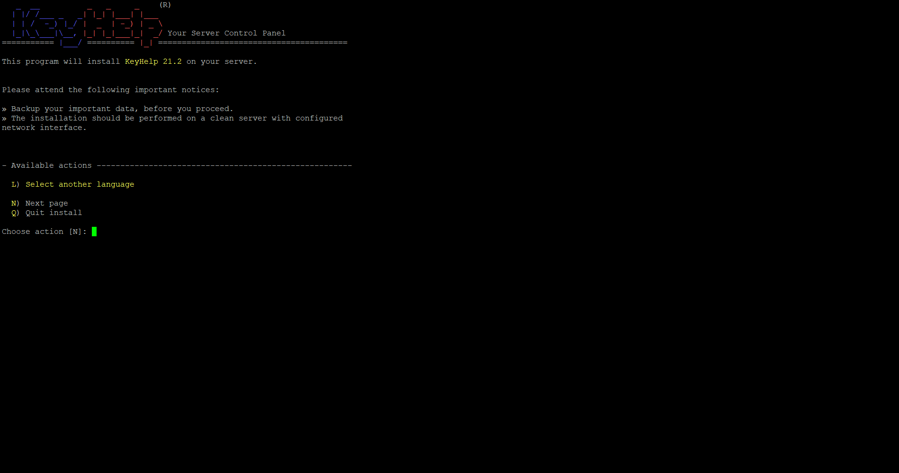
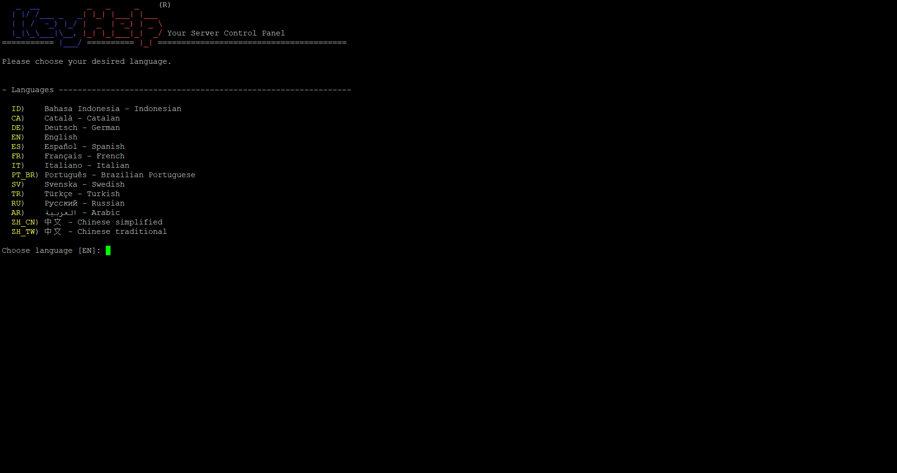
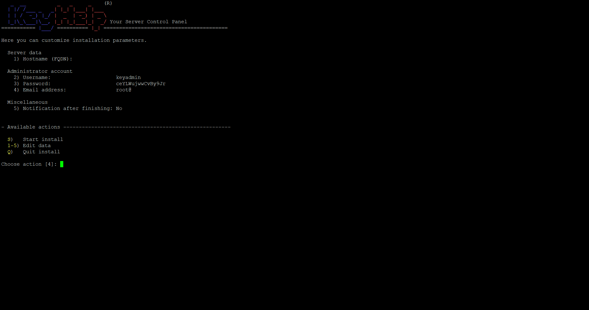
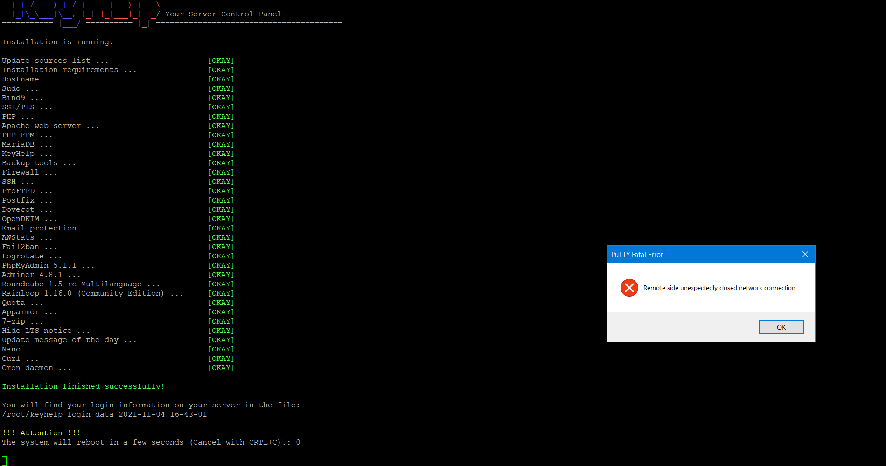
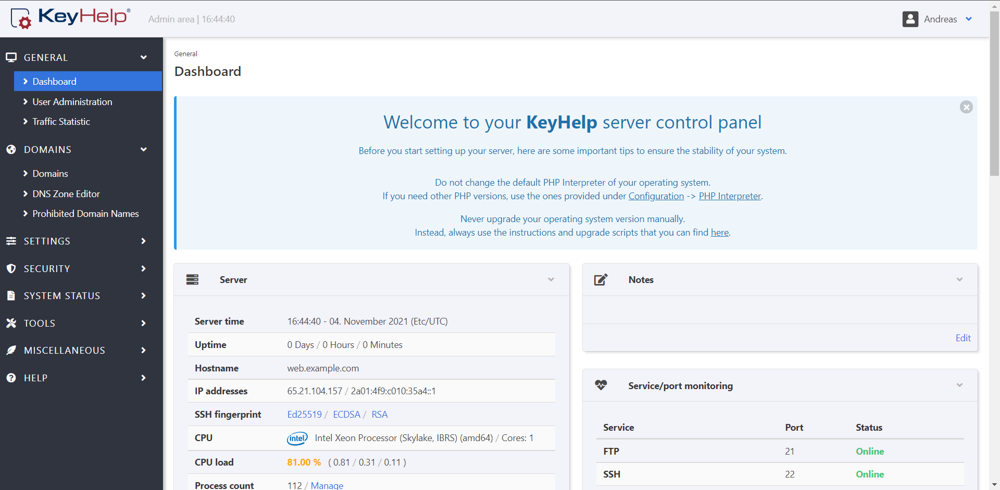

# Introduction

This tutorial explains how to install KeyHelp on a netcup `VPS 1000 G9`.

# Requirements

You need an empty VPS with root access and Debian or Ubuntu OS installed. I have had installations with only 1GB RAM that worked fine, but I recommend a minimum of 4GB RAM and two cores, just like a `VPS 500 G8`.
You also need a domain that points to your VPS and that you will use for the Control Panel. In this tutorial, `example.com` is used as an example domain.

# Step 1 - Dependencies

First, update your package manager.

```
apt update
```

Please install the `wget` and `ca-certificates` packages so that no error occurs during the installation.

```
apt install wget ca-certificates -y
```

# Step 2 - Install KeyHelp

You can install KeyHelp by simply pasting this line:

```
wget https://install.keyhelp.de/get_keyhelp.php -O install_keyhelp.sh ; bash install_keyhelp.sh ;
```

and pressing <kbd>Enter</kbd>.

The installer will be downloaded and executes itself automatically.

At this point, PHP, KeyHelp and IonCube will be installed.

## Step 2.1 - Language


Now, you will be prompted to choose a language. If you want to keep the installation in English, simply continue by entering `N` and pressing <kbd>Enter</kbd>. You can exit the installer anytime by hitting `Q`.

If you want to continue in another language, enter `L` and press <kbd>Enter</kbd>.


You can choose what language you want, type in the country code next to your language in brackets and press <kbd>Enter</kbd>.

Continue by entering `N` and pressing <kbd>Enter</kbd>.

## Step 2.2 - Host settings


You can now customize the installation parameters. I want to change the hostname, so I enter `1` for and press <kbd>Enter</kbd>. Then I enter the hostname `example.com` and confirm it by pressing <kbd>Enter</kbd>. I now repeat this for the other settings.


When you are done, type `S` and press <kbd>Enter</kbd> to start the installation.



If the installation is complete, the server will reboot itself.

# Step 3 - Your first login


Now when you visit your domain `https://example.com`you will see the KeyHelp login. Enter your username and password that you defined in step 2.2 and press "Login".

The panel should look like this:


# Step 4 - Going further

You can now create users, domains, mailboxes and databases with KeyHelp. Maybe someone will continue this tutorial. In the meantime, you can look at the documentation https://doc.keyhelp.de/switch/?lang=en and continue.

# Conclusion

You now have a fully intact KeyHelp installation on your VPS to host websites and even resell your system power to others.

# License

MIT

# Contributor's Certificate of Origin

Contributor's Certificate of Origin By making a contribution to this project, I certify that:

1.  The contribution was created in whole or in part by me and I have the right to submit it under the license indicated in the file; or

2.  The contribution is based upon previous work that, to the best of my knowledge, is covered under an appropriate license and I have the right under that license to submit that work with modifications, whether created in whole or in part by me, under the same license (unless I am permitted to submit under a different license), as indicated in the file; or

3.  The contribution was provided directly to me by some other person who certified (a), (b) or (c) and I have not modified it.

4.  I understand and agree that this project and the contribution are public and that a record of the contribution (including all personal information I submit with it, including my sign-off) is maintained indefinitely and may be redistributed consistent with this project or the license(s) involved.

Signed off by: Andreas Fink mail@afink.dev
