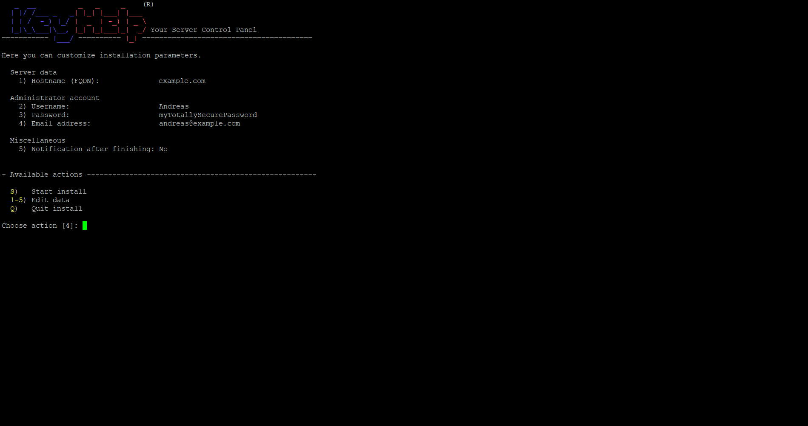
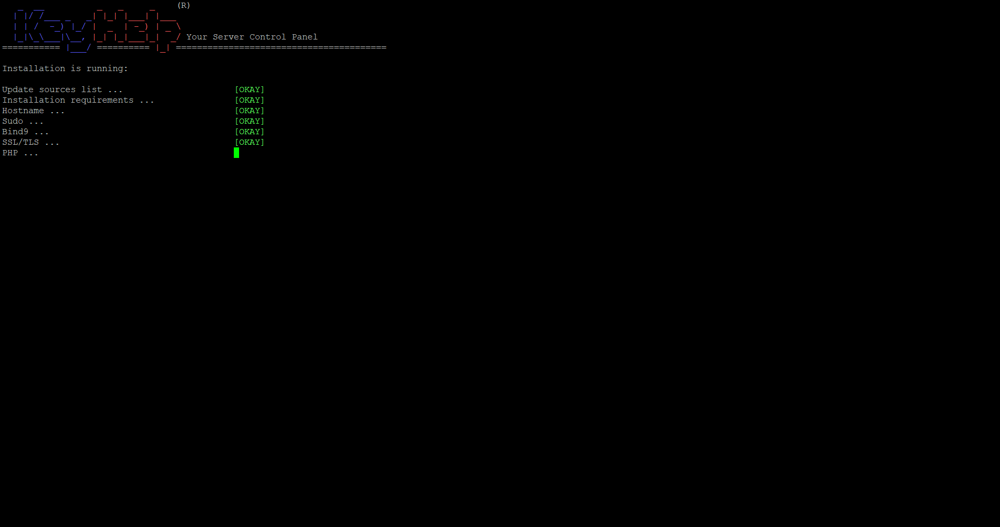
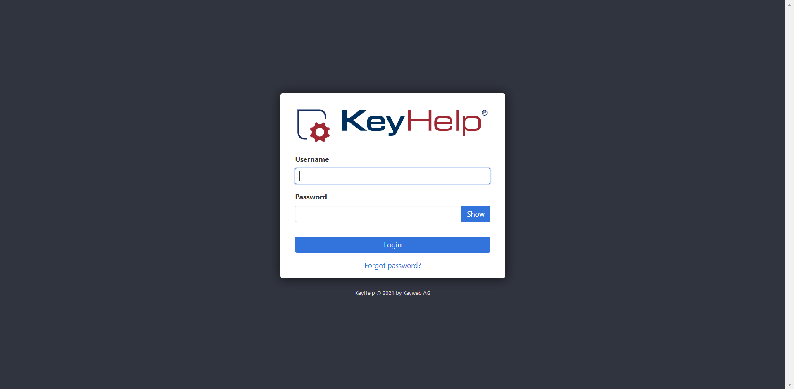

# Introduction
This tutorial will show you how to install KeyHelp on a Netcup VPS 1000 G9.

# Requirements
You need an empty VPS with root access with the OS Debian or Ubuntu.
A Domain pointed to your VPS that you will use for the controlpanel. In this tutorial I will use `example.com`.

# Step 1 - Dependencies
First, update your package manager.

```
apt update
```

Please install the package `ca-certificates`, so that no error occures while the installation.

```
apt install ca-certificates -y
```

# Step 2 - Install KeyHelp
You can install KeyHelp just by pasting this line:
```
wget https://install.keyhelp.de/get_keyhelp.php -O install_keyhelp.sh ; bash install_keyhelp.sh ;
```

The installer will be downloaded and executes itself automatically.

At this point, PHP, Keyhelp and IonCube will be installed.

## Step 2.1 - Language

Now, you will be prompted with this. If you want to keep the installation in english, just continue by entering `N` and pressing <kbd>Enter</kbd>. You can exit the installer anytime by entering `Q`.

If you want to continue in another language, enter `L` and press <kbd>Enter</kbd>


Now, you can choose what language you want, type in the countrycode next to your language in brackets and press <kbd>Enter</kbd>.

Now continue by entering `N` and pressing <kbd>Enter</kbd>.

## Step 2.2 - Host settings

You can now customize installation parameters. For me, I change the the hostname to `example.com` by entering 1 for editing the hostname and pressing <kbd>Enter</kbd>. I then enter the hostname web.domain.com and confirm it by pressing <kbd>Enter</kbd>. I now repeat this for the other settings.



If you are finished, continue by entering `S` and pressing <kbd>Enter</kbd>, this will start the installation.




If the installation is finished, the server will reboot itself.


# Step 3 - Your first login

If you now visit your domain `https://example.com`, you can see the KeyHelp-login. <kbd>Enter</kbd> your username and passwort set while step 2.2 and press login.


The panel should look like this.

# Step 4 - Going further
You can now create users, domains, mailboxes and databases using KeyHelp. Maybe someone will continue this tutorial. In the meantime you can look at the docs https://doc.keyhelp.de/switch/?lang=en and carry on.

# Conclusion
You have now a fully intact KeyHelp installation on your VPS to host websites and even resell your system power to other people.

# License
MIT

# Contributor's Certificate of Origin
Contributor's Certificate of Origin By making a contribution to this project, I certify that:

 1) The contribution was created in whole or in part by me and I have the right to submit it under the license indicated in the file; or

 2) The contribution is based upon previous work that, to the best of my knowledge, is covered under an appropriate license and I have the right under that license to submit that work with modifications, whether created in whole or in part by me, under the same license (unless I am permitted to submit under a different license), as indicated in the file; or

 3) The contribution was provided directly to me by some other person who certified (a), (b) or (c) and I have not modified it.

 4) I understand and agree that this project and the contribution are public and that a record of the contribution (including all personal information I submit with it, including my sign-off) is maintained indefinitely and may be redistributed consistent with this project or the license(s) involved.

Signed-off-by: Andreas Fink mail@afink.dev
