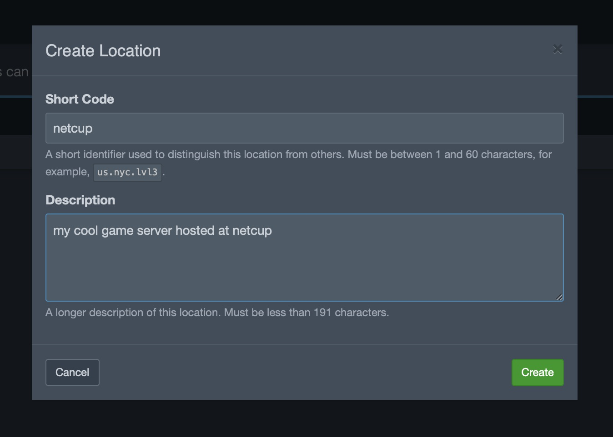
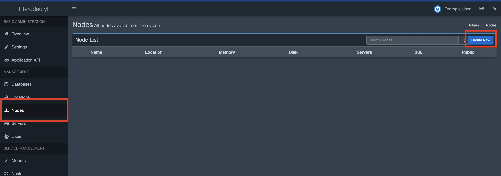
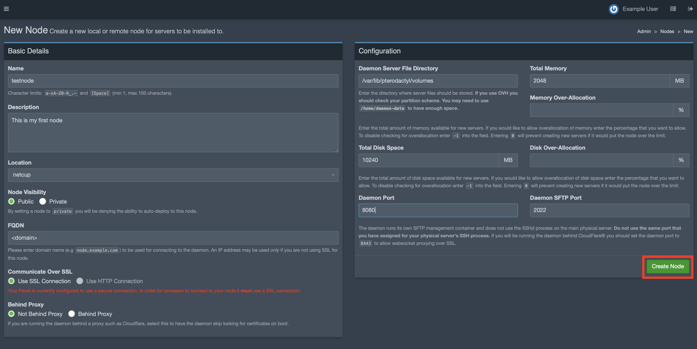
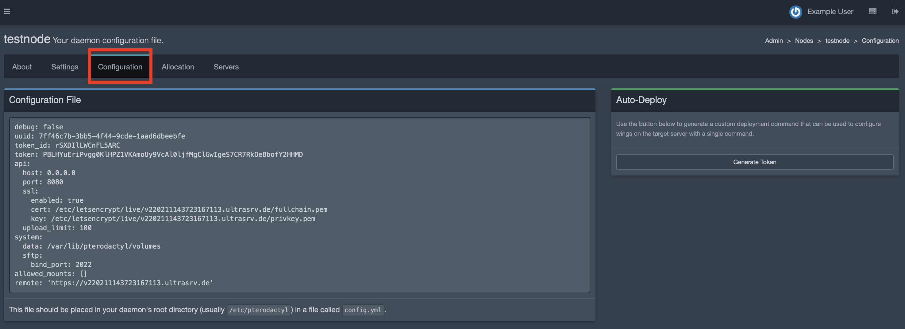
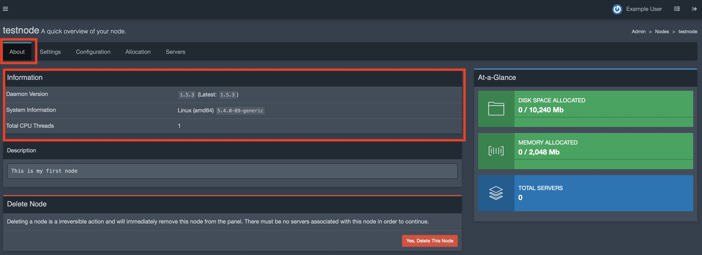
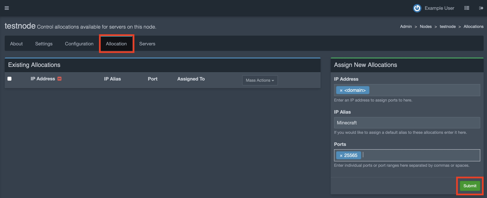
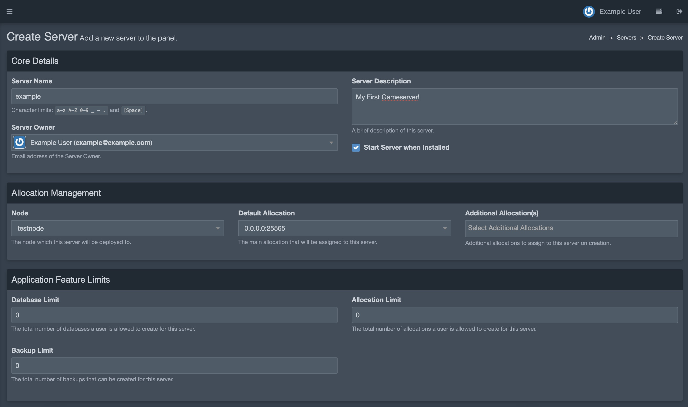
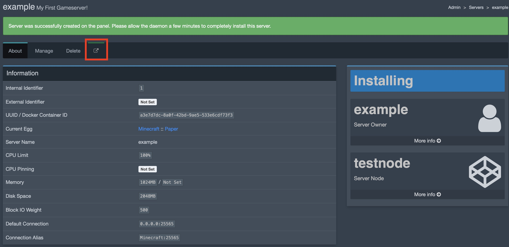
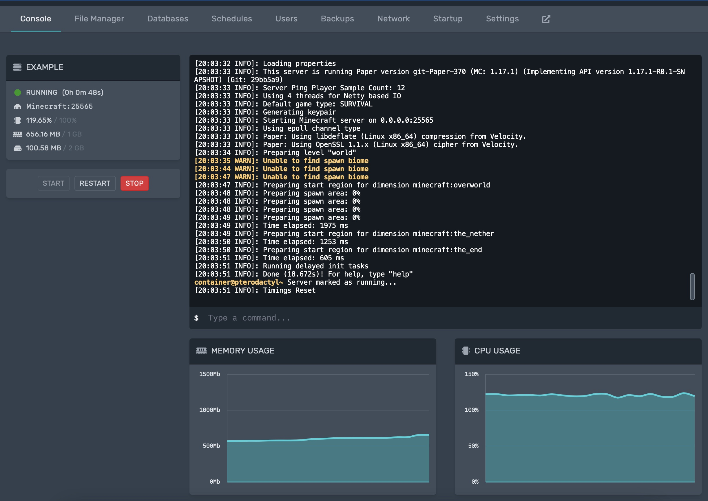

# Introduction

This tutorial will teach you how to install the Pterodactyl game server panel on Ubuntu Linux. Pterodactyl allows you to host game servers of any kind on multiple hosts. Pterodactyl includes a handy web panel with multiuser support for managing game servers.

# Requirements

You can install this software on any root- or vServer. The panel can also be installed on webhosting products.
**I have no Webhosting to test. Help wanted!**
I assume you have Docker, docker-compose and git already installed.

> For your gameserver, Wings daemon and web panel to be publicly reachable you need to open ports **80**, **443**, **8080**, **2022** and all ports used by your game servers (eg. Minecraft: **25565**).

I'm using [Pterodactyl Containers](https://github.com/ccarney16/pterodactyl-containers) from GitHub since this is easier to setup than directly on the host system. For further help have a look at [the offical documentation](https://pterodactyl.io/project/introduction.html).

# Step 1 - Preparation

To check whether you already have docker, docker-compose and git installed run:

```bash
sudo docker-compose version
git --version
```

If that's the case create the folder and clone the repository by running

```bash
git clone https://github.com/ccarney16/pterodactyl-containers.git
cd pterodactyl-containers
```

# Step 2 - Initial Configuration

The project comes with a handy script to automatically generate the docker-compose files tailored for your needs. To create one, run:

> If you don't want to host your game servers on the same host as your panel, you can omit `--daemon` to skip daemon setup.

```bash
bin/deploy --panel --database --letsencrypt --daemon
```

This script creates a `docker-compose.yml` file and a few configuration files.

# Setup 2.1 - Panel Configuration

To configure your web panel open the file `conf.d/panel.env` with the editor of your choice (e.g. `nano conf.d/panel.env`).

The file contains a few configuration options. See comments for further information about them:

```diff
##
# Pterodactyl Container Variables
#
# DO NOT OVERWRITE WITH PTERODACTYL ".env" CONFIGURATIONS!
# This configuration may look like it has pterodactyl
# variables, and it does, however this config also contains
# variables to initialize/setup the containers. If you are migrating
# or planning to use /data/pterodactyl.conf for all your variables,
# remove anything after "panel variables" stated.
##

##
# Container Variables
##

# Location of SSL Certificate and key
# Point to a valid certificate to enable https.

## This has to be changed later while configuring lets encrypt for your panel
SSL_CERT="/etc/certs/cert.pem"
SSL_CERT_KEY="/etc/certs/cert.key"

##
# Panel Variables
# These variables can be used within pterodactyl.conf (.env when symlinked
# into the docker webroot). These variables are also set via pterodactyl:env
# and pterodactyl:mail.
##

# This is the base url for your pterodactyl panel. This should be pointing to your domain
- APP_URL=http://localhost/
+ APP_URL=http://<domain>/

APP_ENV=production
APP_DEBUG=false # DO NOT ENABLE!!! This toggles the ability to enable debug messages on errors.

# Use this to define your timezone. For German users that would be: Europe/Berlin
- APP_TIMEZONE=America/New_York
+ APP_TIMEZONE=Europe/Berlin

APP_ENVIRONMENT_ONLY=true

# Cache/Session Settings
# You dont need to change any of these
CACHE_DRIVER=redis
SESSION_DRIVER=redis
QUEUE_CONNECTION=redis

# Redis Settings
REDIS_HOST=cache
REDIS_PORT=6379

# MySQL Settings
# While youre not using the mysql instance from outside the docker stack you dont need to modify this variables
DB_HOST=mysql
DB_PORT=3306
DB_DATABASE=pterodactyl
DB_USERNAME=ptero
DB_PASSWORD=pterodbpass

# Mail Settings
# Use this to configure your email settings.
MAIL_DRIVER=mail
MAIL_HOST=mailtrap.io
MAIL_PORT=2525
MAIL_USERNAME=
MAIL_PASSWORD=
MAIL_ENCRYPTION=tls
MAIL_FROM=no-reply@example.com
```

After editing save the modified configuration file.

To start your panel for the first time run

```bash
docker-compose up -d
```

To create your initial user run:

```bash
docker-compose exec panel php artisan p:user:make
```

You will be asked a few question. Make sure to answer `yes` to the first question (admin user). The result should be something like this:

```bash
Is this user an administrator? (yes/no) [no]:
 > yes

 Email Address:
 > example@example.com

 Username:
 > example

 First Name:
 > Example

 Last Name:
 > User

Passwords must be at least 8 characters in length and contain at least one capital letter and number.
If you would like to create an account with a random password emailed to the user, re-run this command (CTRL+C) and pass the `--no-password` flag.

 Password:
 > ********

+----------+--------------------------------------+
| Field    | Value                                |
+----------+--------------------------------------+
| UUID     | 26eaeeab-0ee5-4d62-aa46-6626cedea3fc |
| Email    | example@example.com                  |
| Username | example                              |
| Name     | Example User                         |
| Admin    | Yes                                  |
+----------+--------------------------------------+
```

# Step 2.2 - SSL Configuration

To secure your panel it is necessary to configure SSL. For this purpose, a certbot container is included with the setup.

To generate your SSL certificate files run:

```
docker-compose run --rm --service-ports certbot certonly -d <domain>
```

This will request a certificate from Let's Encrypt and stores it inside `conf.d/letsencrypt/`. After requesting your certificate you need to add it to your panel's configuration. Modify the following lines:

```bash
nano conf.d/panel.env
```

```diff
- SSL_CERT="/etc/certs/cert.pem"
- SSL_CERT_KEY="/etc/certs/cert.key"
+ SSL_CERT="/etc/letsencrypt/live/<domain>/fullchain.pem"
+ SSL_CERT_KEY="/etc/letsencrypt/live/<domain>/privkey.pem"

APP_URL=http://<domain>/
```

Let's Encrypt will automatically manage your certificates and automatically request new ones when they're about to expire.

Now recreate your panel's container to apply the changes:

```bash
docker-compose down && docker-compose up -d
```

You can access your panel now by opening `https://<domain>/`. Login using your credentials configured earlier.

# Step 3 - Daemon configuration

To configure your daemon you need to open the administrator tab on the web ui:


To configure your new node you need to add a new location first. To do so, open the **Locations** tab and click **Create New**:


Fill in the information and click **Create**:



To configure your new node navigate to the **Nodes** tab and click **Create New**:



Here you need to fill in all fields. Tailor the values to your needs. It's important to configure the domain the same as used for your Let's Encrypt configuration!



Click **create** to create the new nodes configuration.

Open the **Configuration** tab to copy your new nodes config file:


You need to copy your nodes config shown in this page and paste it into a file located at `conf.d/daemon/config.yml`. This file should look similar to this:

```yaml
debug: false
uuid: xxxx
token_id: xxxx
token: xxxx
api:
  host: 0.0.0.0
  port: 8080
  ssl:
    enabled: true
    cert: /etc/letsencrypt/live/<domain>/fullchain.pem
    key: /etc/letsencrypt/live/<domain>/privkey.pem
  upload_limit: 100
system:
  data: /var/lib/pterodactyl/volumes
  sftp:
    bind_port: 2022
allowed_mounts: []
remote: "https://<domain>"
```

Your daemon will recognize the config file automatically and report its status to Pterodactyl.

To check whether this works, open the **about** tab and make sure the **Information** panel displays information about the panel:



**Congratulations!!** you have successfully installed Pterodactyl and your first Wings client. You can do the same for other hosts.
Skip the `--panel` and `--database` flags and all panel related configuration to just install the daemon on another system.

## Step 4 - Add allocations for your newly created daemon

In order for your game servers to be publicly reachable you need to have a few ports open for the public. Add an allocation by opening the **Nodes** **Allocation** tab and fill in the appropriate information. Click **save** to save your new allocation. Minecraft, for example, uses port `25565` for its game servers.



## Step 5 - Add game server

Now it's time to create your first game server!

For that, open the **Servers** tab and click **Create New**.

Fill in the appropriate information and click **Create Server**:




After that, wait a few seconds while Pterodactyl is installing your server.
When it's done, click the **open** icon to control your new server:



Click **start** to start your server.



# Conclusion

**Congratulations (again)!!** You now have your first Minecraft server up and running for the public. You can now start to create more servers or start configuring your new Minecraft server. More Information about usage of the web panel can be found on the web, but it's pretty self explainatory. More details about game server management is outside of scope for this tutorial since it is only about installation and configuration.

Pterodactyl itself only includes a hand full of game servers. The community is maintaining a whole list of games ready to be installed. You can find a comprehensive list of so called **eggs** [here](https://github.com/parkervcp/eggs).

# License

Permission is hereby granted, free of charge, to any person obtaining a copy
of this software and associated documentation files (the "Software"), to deal
in the Software without restriction, including without limitation the rights
to use, copy, modify, merge, publish, distribute, sublicence, and/or sell
copies of the Software, and to permit persons to whom the Software is
furnished to do so, subject to the following conditions:

The above copyright notice and this permission notice shall be included in all
copies or substantial portions of the Software.

THE SOFTWARE IS PROVIDED "AS IS", WITHOUT WARRANTY OF ANY KIND, EXPRESS OR
IMPLIED, INCLUDING BUT NOT LIMITED TO THE WARRANTIES OF MERCHANTABILITY,
FITNESS FOR A PARTICULAR PURPOSE AND NONINFRINGEMENT. IN NO EVENT SHALL THE
AUTHORS OR COPYRIGHT HOLDERS BE LIABLE FOR ANY CLAIM, DAMAGES OR OTHER
LIABILITY, WHETHER IN AN ACTION OF CONTRACT, TORT OR OTHERWISE, ARISING FROM,
OUT OF OR IN CONNECTION WITH THE SOFTWARE OR THE USE OR OTHER DEALINGS IN THE
SOFTWARE.

# Contributor's Certificate of Origin

By making a contribution to this project, I certify that:

1.  The contribution was created in whole or in part by me and I have the right to submit it under the license indicated in the file; or

2.  The contribution is based upon previous work that, to the best of my knowledge, is covered under an appropriate license and I have the right under that license to submit that work with modifications, whether created in whole or in part by me, under the same license (unless I am permitted to submit under a different license), as indicated in the file; or

3.  The contribution was provided directly to me by some other person who certified (a), (b) or (c) and I have not modified it.

4.  I understand and agree that this project and the contribution are public and that a record of the contribution (including all personal information I submit with it, including my sign-off) is maintained indefinitely and may be redistributed consistent with this project or the license(s) involved.
