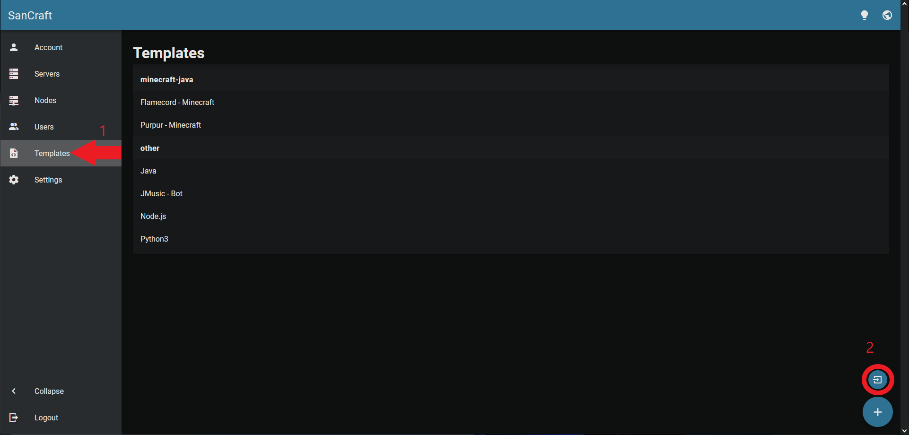
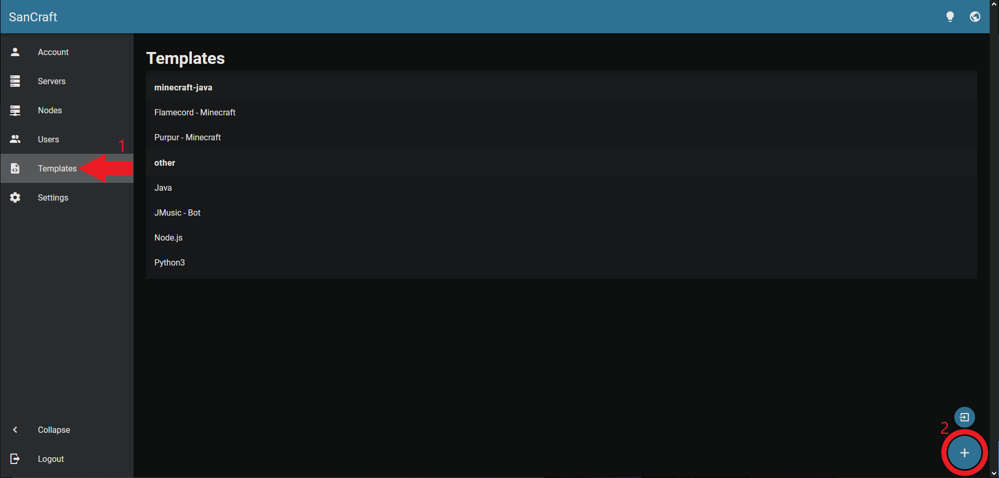
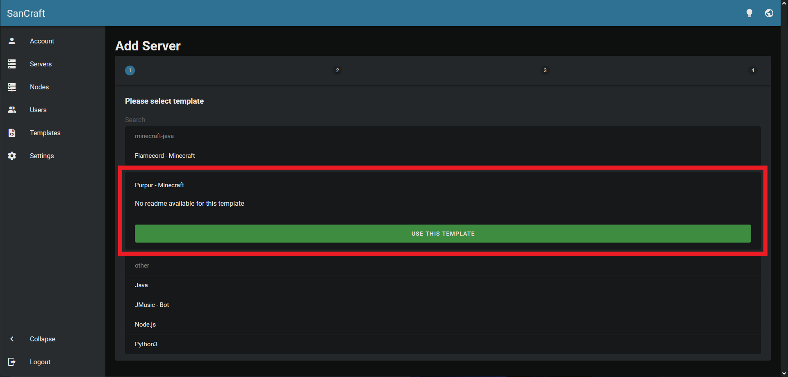
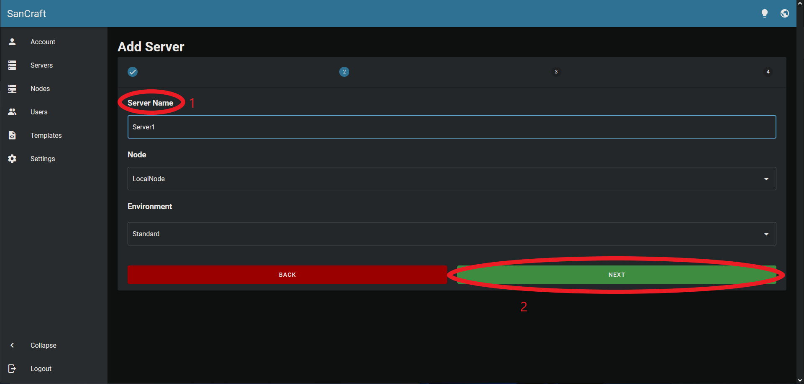

# Introduction

This tutorial explains how to install PufferPanel on a Debian or Ubuntu server (e.g. "RS 2000" server) through apt and how you can set up an Apache2 reverse proxy on it.<br>
PufferPanel is a simple web panel for game servers and much more!<br>
I am doing this on a Debian 11 server, but it should also work on other Debian versions and on Ubuntu.<br>
This tutorial is based on the PufferPanel docs https://docs.pufferpanel.com/en/2.x/installing.html, https://github.com/SanCraftDev/Debian-Setup/blob/main/README.md#Snapd and https://github.com/SanCraftDev/Debian-Setup/blob/main/README.md#Apache-and-Certbot.

# Requirements

You need a Debian or Ubuntu server with an internet connection. The server must be reachable from the internet via a static IP on ports `8080` and `5657`.<br>
You also need root permissions on your server. <br>
If you want to use HTTPS and a domain or subdomain, the server must be open to the internet on ports `80` and `443`. <br>
If you want to use PufferPanel for Minecraft servers, you must have Java 17 installed (see step 0).

# Step 0 - Install Java (optional, needed for Minecraft servers)

```sh
su
apt update && apt upgrade -y && apt autoremove -y
apt install gnupg software-properties-common wget curl sudo nano screen cron -y
wget -O- https://apt.corretto.aws/corretto.key | apt-key add -
add-apt-repository 'deb https://apt.corretto.aws stable main'
apt update; apt install java-17-amazon-corretto-jdk maven -y
```

# Step 1 - Install the panel

First you need to connect to your server via SSH.<br>
Then switch to the root user and update your system. After that, proceed with the installation of PufferPanel:

```sh
su
apt update && apt upgrade -y && apt autoremove -y
apt install wget curl sudo nano screen cron -y
curl -s https://packagecloud.io/install/repositories/pufferpanel/pufferpanel/script.deb.sh | sudo bash
sudo apt-get install pufferpanel -y
```

Create a start file:

```sh
nano /etc/pufferpanel/start.sh
```

Now paste here:

```
screen -AmdS pp /usr/sbin/pufferpanel run
```

Save your changes by first pressing <kbd>CTRL + X</kbd>, then press <kbd>y</kbd> and finally hit <kbd>ENTER</kbd>.<br>
Run this script to start PufferPanel:

```sh
chmod +x /etc/pufferpanel/start.sh
```

If you want to run PufferPanel on boot, enter this command:

```sh
{ crontab -l 2>/dev/null; echo "@reboot sleep 10 && cd /etc/pufferpanel/ && ./start.sh" ; } | crontab -
```

# Step 1.1 - Add a user & start the panel

Now we add a PufferPanel user. <br>

```sh
pufferpanel user add
```

```
First enter a username
Now enter your email address
Next enter a secure password and confirm it
Select y to make the user an admin user
```

Now you can start the panel for the first time:

```sh
cd /etc/pufferpanel/
/etc/pufferpanel/start.sh
```

You can reach the panel via http://your-ip:8080.

# Step 2 - Install Apache2 and related tools (optional)

## Step 2.1 - Install snapd and Certbot: You can skip this step if you have Certbot already installed and running.

First we need to install snapd and Certbot to get SSL certificates:

```sh
apt update && apt upgrade -y && apt autoremove -y
apt install snapd -y
snap install core; snap refresh core
sudo snap install --classic certbot
sudo ln -s /snap/bin/certbot /usr/bin/certbot
{ crontab -l 2>/dev/null; echo "$(( $RANDOM % 60 )) $(( $RANDOM % 3 + 3 )) * * * sudo certbot renew --dry-run" ; } | crontab -
```

## Step 2.2 - Install Apache2: You can skip this step if you have Apache2 already installed and running.

Now we are going to install Apache2:

```sh
apt install apache2 libapache2-mod-php -y
```

In the next step, we are going to configure Apache2:

```sh
a2enmod rewrite
a2enmod headers
a2enmod env
a2enmod dir
a2enmod mime
a2enmod proxy
a2enmod proxy_http
a2enmod proxy_wstunnel
a2enmod headers
a2enmod ssl
```

```sh
nano /etc/apache2/apache2.conf
```

Now search with <kbd>CTRL + W</kbd> for `<Directory /var/www/>`<br>
Now go some lines down to `AllowOverride None` and replace it with `AllowOverride All` <br>

```diff
- AllowOverride None
+ AllowOverride All
```

Save your changes by first pressing <kbd>CTRL + X</kbd>, then press <kbd>y</kbd> and finally hit <kbd>ENTER</kbd>. Restart Apache2:

```sh
service apache2 restart
```

## Step 2.3 Install the PufferPanel configuration

First create a subdomain or domain that is linked to your server- <br>
Now create an SSL certificate (replace DOMAIN with your domain or subdomain):

```sh
certbot certonly --apache -d DOMAIN
```

Create the Apache2 configuration:

```sh
nano /etc/apache2/sites-enabled/pp.conf
```

Now paste here:

```
<VirtualHost *:80>
    ServerName DOMAIN
    Redirect permanent / https://DOMAIN/
	Protocols h2 h2c http/1.1
    ErrorLog /var/log/apache2/pp.error.log
</VirtualHost>

<VirtualHost *:443>
    ServerName DOMAIN

        ProxyPreserveHost On
        SSLProxyEngine On
        ProxyPass / http://localhost:8080/
        ProxyPassReverse / http://localhost:8080/

        RewriteEngine on
        RewriteCond %{HTTP:Upgrade} websocket [NC]
        RewriteCond %{HTTP:Connection} upgrade [NC]
        RewriteRule .* ws://localhost:8080%{REQUEST_URI} [P]

	Protocols h2 h2c http/1.1
    ErrorLog /var/log/apache2/pp.error.log
SSLCertificateFile /etc/letsencrypt/live/DOMAIN/fullchain.pem
SSLCertificateKeyFile /etc/letsencrypt/live/DOMAIN/privkey.pem
</VirtualHost>
```

Edit this configuration and replace every `DOMAIN` with your domain or subdomain.<br>
Save your changes by first pressing <kbd>CTRL + X</kbd>, then press <kbd>y</kbd> and finally hit <kbd>ENTER</kbd>.<br>
Restart Apache2:

```sh
service apache2 restart
```

You should now be able to open PufferPanel with https://DOMAIN/.<br>
If you do this directly on a domain and NOT on a subdomain, I recommend to repeat this step with www.DOMAIN.

# Step 3 - Create the first server

Also see the screenshots below.<br>
Log in to your PufferPanel with your email address and password via http://your-ip:8080 or https://DOMAIN/ <br>
Go to `Templates` and import the templates you want or download some templates from https://github.com/SanCraftDev/PufferPanel-templates/blob/main/README.md <br>
Now go to `Servers`, press `+` and select the template you want. Follow the steps, at the end select `Install` on the top left and then you can start your server! <br>
Under `Admin` you can set your server to start on boot! <br>
Don't forget to open the correct port of the server you created in Pufferpanel, if it requires an open port (for example, a Minecraft server/proxy requires port 25565).

# Images

## Import a template


Select here the templates you want to use (some default templates are outdated).


## Add a downloaded template


Paste in here the content of the template you downloaded:


## Create a server






# Conclusion

With this tutorial you installed PufferPanel, maybe set up a reverse proxy for PufferPanel in Apache2 and created your first server! <br>
This tutorial is based on the PufferPanel docs https://docs.pufferpanel.com/en/2.x/installing.html, https://github.com/SanCraftDev/Debian-Setup/blob/main/README.md#Snapd and https://github.com/SanCraftDev/Debian-Setup/blob/main/README.md#Apache-and-Certbot.

# License

MIT

# Contributor's Certificate of Origin

By making a contribution to this project, I certify that:

1.  The contribution was created in whole or in part by me and I have the right to submit it under the license indicated in the file; or

2.  The contribution is based upon previous work that, to the best of my knowledge, is covered under an appropriate license and I have the right under that license to submit that work with modifications, whether created in whole or in part by me, under the same license (unless I am permitted to submit under a different license), as indicated in the file; or

3.  The contribution was provided directly to me by some other person who certified (a), (b) or (c) and I have not modified it.

4.  I understand and agree that this project and the contribution are public and that a record of the contribution (including all personal information I submit with it, including my sign-off) is maintained indefinitely and may be redistributed consistent with this project or the license(s) involved.

Signed off by: Jonas Löchner | [admin@san0j.de](mailto:admin@san0j.de)
