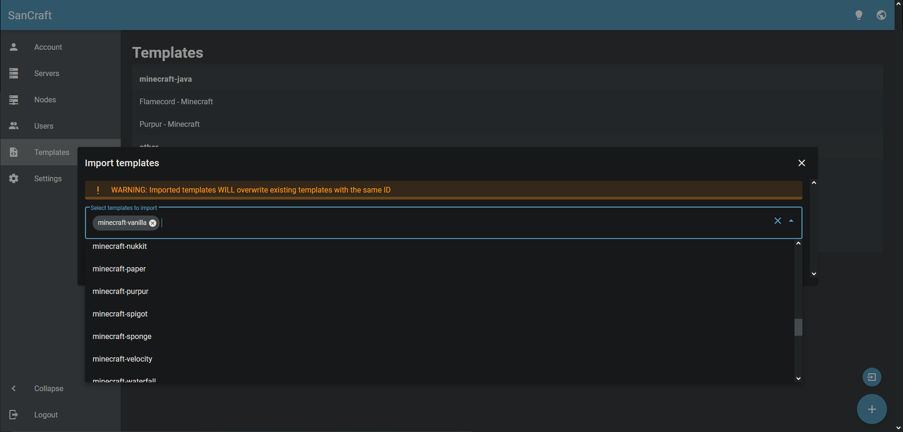
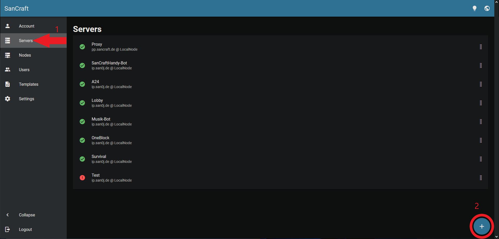
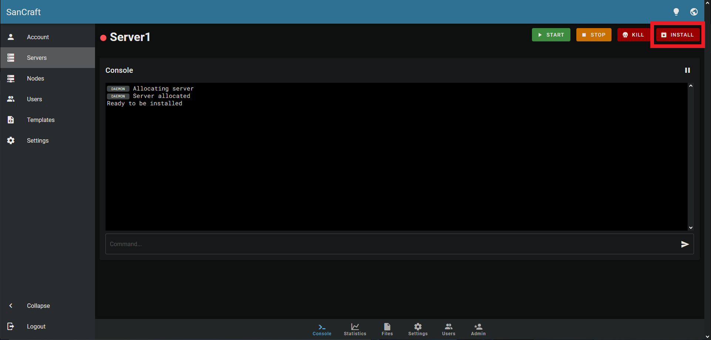
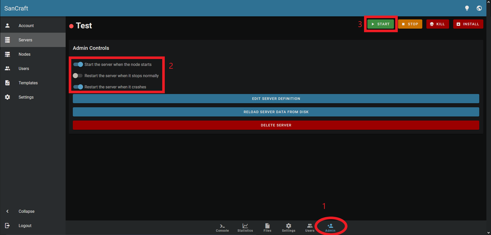

# Introduction

This tutorial explains how to install PufferPanel on a Debian or Ubuntu server (e.g. "RS 2000" server) and can set up an Apache2 reverse proxy.<br>
PufferPanel is a simple web panel for game servers and other things.<br>
I am doing this on a Debian 11 based server, but this tutorial should also work on other Debian versions and on Ubuntu.<br>
This tutorial is based on the PufferPanel docs found at https://docs.pufferpanel.com/en/2.x/installing.html, https://github.com/SanCraftDev/Debian-Setup/blob/main/README.md#Snapd and https://github.com/SanCraftDev/Debian-Setup/blob/main/README.md#Apache-and-Certbot.

# Requirements

You need a Debian or Ubuntu server with an internet connection. The server must be accessible via a static IP on ports `8080` and `5657`.<br>
You also need root permissions on the server. <br>
If you want to use HTTPS and a domain or subdomain, the server must be open to the internet on ports `80` and `443`. <br>
If you want to use PufferPanel for Minecraft servers, you must have Java 17 installed (see step 0).

# Step 0 - Installing Java (optional, necessary for Minecraft servers)

```sh
su
apt update && apt upgrade -y && apt autoremove -y
apt install gnupg software-properties-common wget curl sudo nano screen cron -y
wget -O- https://apt.corretto.aws/corretto.key | apt-key add -
add-apt-repository 'deb https://apt.corretto.aws stable main'
apt update; apt install java-17-amazon-corretto-jdk maven -y
```

# Step 1 - Installing the PufferPanel

First you need to connect to your server via SSH.<br>
Then switch to the root user and update your system. After that, proceed with the installation of PufferPanel:

```sh
su
apt update && apt upgrade -y && apt autoremove -y
apt install wget curl sudo nano screen cron -y
curl -s https://packagecloud.io/install/repositories/pufferpanel/pufferpanel/script.deb.sh | sudo bash
{ crontab -l 2>/dev/null; echo "* * * * * chown -R pufferpanel:pufferpanel /var/lib/pufferpanel/" ; } | crontab -
{ crontab -l 2>/dev/null; echo "* * * * * chown -R pufferpanel:pufferpanel /etc/pufferpanel/" ; } | crontab -
sudo apt-get install pufferpanel -y
```

If you want to automatically start PufferPanel on boot, enter this command:

```sh
systemctl enable pufferpanel
```

# Step 1.1 - Add a user & start PufferPanel

Now we add a PufferPanel user: <br>

```sh
pufferpanel user add
```

You will be asked to provide a username, your email address and a secure passphrase.

Now you can start PufferPanel for the first time:

```sh
systemctl start pufferpanel
```

You can access the panel via http://your-ip:8080.

# Step 2 - Install Apache2 and related tools (optional)

## Step 2.1 - Install snapd and Certbot (this step can be skipped if Certbot has already been installed)

First, we need to install snapd and Certbot so we can create SSL certificates:

```sh
apt update && apt upgrade -y && apt autoremove -y
apt install snapd -y
snap install core; snap refresh core
sudo snap install --classic certbot
sudo ln -s /snap/bin/certbot /usr/bin/certbot
{ crontab -l 2>/dev/null; echo "$(( $RANDOM % 60 )) $(( $RANDOM % 3 + 3 )) * * * sudo certbot renew --dry-run" ; } | crontab -
```

## Step 2.2 - Install Apache2 (this step can be skipped if Apache2 has already been installed)

Now we are going to install Apache2:

```sh
apt install apache2 libapache2-mod-php brotli -y
```

In the next step, we are going to configure Apache2:

```sh
a2enmod rewrite headers env dir mime proxy proxy_http proxy_wstunnel headers ssl http2 expires filter brotli
a2disconf other-vhosts-access-log
a2dismod mpm_prefork
a2enmod mpm_event
nano /etc/apache2/apache2.conf
```

Now search with <kbd>CTRL + W</kbd> for `<Directory /var/www/>`<br>
Look for `AllowOverride None` and replace it with `AllowOverride All` <br>

```diff
- AllowOverride None
+ AllowOverride All
```

Next, add the following at the end of the file:

```
Protocols h2 h2c http/1.1
SetOutputFilter BROTLI_COMPRESS
SetEnvIfNoCase Request_URI \.(?:gif|jpe?g|png)$ no-brotli
<IfModule mod_headers.c>
    # Serve brotli compressed CSS files if they exist
    # and the client accepts brotli.
    RewriteCond "%{HTTP:Accept-encoding}" "br"
    RewriteCond "%{REQUEST_FILENAME}\.br" "-s"
    RewriteRule "^(.*)\.css"              "$1\.css\.br" [QSA]
    # Serve brotli compressed JS files if they exist
    # and the client accepts brotli.
    RewriteCond "%{HTTP:Accept-encoding}" "br"
    RewriteCond "%{REQUEST_FILENAME}\.br" "-s"
    RewriteRule "^(.*)\.js"               "$1\.js\.br" [QSA]

    Header set Vary *
    # Serve correct content types, and prevent double compression.
    RewriteRule "\.css\.br$" "-" [T=text/css,E=no-brotli:1]
    RewriteRule "\.js\.br$"  "-" [T=text/javascript,E=no-brotli:1]
    <FilesMatch "(\.js\.br|\.css\.br)$">
      # Serve correct encoding type.
      Header append Content-Encoding br
      # Force proxies to cache brotli &
      # non-brotli css/js files separately.
      Header append Vary Accept-Encoding
    </FilesMatch>
</IfModule>
```

Save your changes by first pressing <kbd>CTRL + X</kbd>, then <kbd>y</kbd> and finally <kbd>ENTER</kbd>.

## Step 2.3 - Configuring PufferPanel

Create a subdomain or domain that is linked to your server. <br>
After that, you need to create an SSL certificate (replace DOMAIN with your domain or subdomain):

```sh
certbot certonly --apache -d DOMAIN
```

Next, create the Apache2 configuration file:

```sh
nano /etc/apache2/sites-enabled/0-pp.conf
```

Now paste the following into this file:

```
<VirtualHost *:80>
    RewriteEngine on
    RewriteCond %{HTTPS} off
    RewriteRule ^/?(.*) https://%{HTTP_HOST}/$1 [R=301,L]

    ErrorLog ${APACHE_LOG_DIR}/http.error.log
</VirtualHost>

<VirtualHost *:443>
    ServerName DOMAIN

    ProxyPreserveHost On
    ProxyPass / http://127.0.0.1:8080/
    ProxyPassReverse / http://127.0.0.1:8080/

    RewriteEngine on
    RewriteCond %{HTTP:Upgrade} websocket [NC]
    RewriteCond %{HTTP:Connection} upgrade [NC]
    RewriteRule .* ws://127.0.0.1:8080%{REQUEST_URI} [P]

    ErrorLog ${APACHE_LOG_DIR}/pp.error.log

    SSLCertificateFile /etc/letsencrypt/live/DOMAIN/fullchain.pem
    SSLCertificateKeyFile /etc/letsencrypt/live/DOMAIN/privkey.pem
</VirtualHost>
```

Edit the configuration file and replace every `DOMAIN` with your domain or subdomain.<br>
Save your changes by first pressing <kbd>CTRL + X</kbd>, then <kbd>y</kbd> and finally <kbd>ENTER</kbd>.<br>
Restart Apache2:

```sh
service apache2 restart
```

You should now be able to open PufferPanel by accessing `https://DOMAIN/`.<br>
If you are not using a subdomain, it is recommend that you also add `www.DOMAIN`.

# Step 3 - Creating the first server

Additional screenshots below.<br>
Log in to your PufferPanel using your email address and password via http://your-ip:8080 or https://DOMAIN/ <br>
Go to `Templates` and import the templates you want to use or download some templates from https://github.com/SanCraftDev/PufferPanel-templates/blob/main/README.md <br>
Now go to `Servers`, press `+` and select the template you would like to use. Follow the steps, then select `Install` on the top left. Now you can start your server. <br>
Under `Admin` you can set your server to automatically start on boot. <br>
Do not forget to open the correct port of the server you created using PufferPanel, if an open port is needed (for example, a Minecraft server/proxy requires port `25565`, you can not use ports below `1024`).

# Images

## Import a template


Here you can select the templates you want to use (some default templates are outdated).


## Add a downloaded template


Paste the content of the template in this field:


## Create a server







# Step 4 - Run PufferPanel inside of a Docker container (optional)

First we need to install Docker:

```sh
apt remove docker docker-engine docker.io containerd runc docker-compose -y
curl -fsSL https://download.docker.com/linux/debian/gpg | sudo gpg --dearmor -o /usr/share/keyrings/docker-archive-keyring.gpg
echo "deb [arch=$(dpkg --print-architecture) signed-by=/usr/share/keyrings/docker-archive-keyring.gpg] https://download.docker.com/linux/debian $(lsb_release -cs) stable" | sudo tee /etc/apt/sources.list.d/docker.list > /dev/null
apt update && apt install docker-ce docker-ce-cli containerd.io -y
systemctl enable --now docker
```

Now we need to give PufferPanel access to Docker and restart PufferPanel:

```sh
sudo groupadd --force --system docker
sudo usermod -a -G docker pufferpanel
systemctl restart pufferpanel
```

# Conclusion

Following this tutorial, you have installed PufferPanel, set up a reverse proxy for PufferPanel using Apache2 and created your first server. <br>
This tutorial is based on the PufferPanel docs found at https://docs.pufferpanel.com/en/2.x/installing.html, https://github.com/SanCraftDev/Debian-Setup/blob/main/README.md#Snapd and https://github.com/SanCraftDev/Debian-Setup/blob/main/README.md#Apache-and-Certbot.

# License

MIT

# Contributor's Certificate of Origin

By making a contribution to this project, I certify that:

1.  The contribution was created in whole or in part by me and I have the right to submit it under the license indicated in the file; or

2.  The contribution is based upon previous work that, to the best of my knowledge, is covered under an appropriate license and I have the right under that license to submit that work with modifications, whether created in whole or in part by me, under the same license (unless I am permitted to submit under a different license), as indicated in the file; or

3.  The contribution was provided directly to me by some other person who certified (a), (b) or (c) and I have not modified it.

4.  I understand and agree that this project and the contribution are public and that a record of the contribution (including all personal information I submit with it, including my sign-off) is maintained indefinitely and may be redistributed consistent with this project or the license(s) involved.

Signed off by: Jonas Löchner | [admin@san0j.de](mailto:admin@san0j.de)
