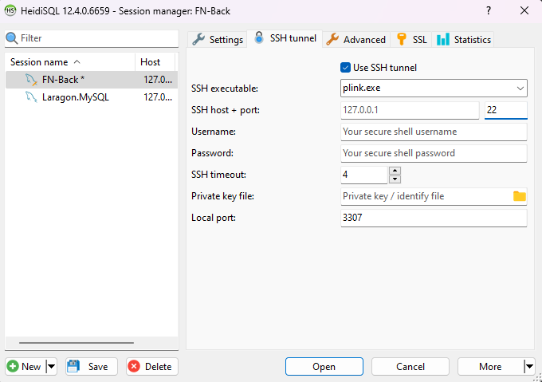

# Introduction
In this Tutorial you will learn to connect to a remote mysql-server (on a netcup vServer) through an SSH-Tunnel. Over such a SSH-Tunnel we can do port-forwarding. In our senario we link the database-port to us. That means, after the successfull connection with the tunnel we access the database-server with `127.0.0.1` and not the public-IP.

But why should do that?

There are two main reasons:
1. You must not open a server port, wich is accessible for the entire internet.
2. Your date is end-to-end encrypted by the SSH-Tunnel.

You see that both points a valid security reasons why we want to do that.

# Requirements
The first basic requirement is, that you need SSH access to your netcup server (vServer, Root-Server).

Then we need [HeidiSQL](https://www.heidisql.com/). HeidiSQL is free mysql client, we want to use it, because HeidiSQL supports connecting through an SSH-Tunnel.

Also you need is a user for the mysql-server (you can use the root user, or you set a new one).

### Why we don't take phpmyadmin?

This is a good question. In this tutorial we don't use phpmyadmin, cause when we use phpmyadmin there is the same problem with an open port on your server. We dont want open ports on our server if we really dont need this.

# Step 1 - Change the Network type

After starting HeidiSQL you will see something like above. If you start HeidiSQL for the first time, you will probably see no entry. On the left down corner you can add a new entry.

Once you created a new Session, on the right side we set some session options:

* Network type: `MariaDB or MySQL (SSH tunnel)`
* Library you choose the one for your server. libmariadb.dll for a MariaDB-Server or libmysql.dll for a MySQL-Server.
* Hostname / IP: `127.0.0.1`
* User: `root` or your new created user
* Password: The password for that user
* Port: `3306`

Next we switch to the 'SSH-tunnel' tab.

# Step 2 - SSH Settings

In this tab we set the options for the SSH-Settings.

* First set the checkbox "Use SSH tunnel"
* SSH executable: `plink.exe`
* SSH host + port: Here you set the public ip/hostname of your server and your SSH-port
* Username: your SSH-Username wich you use to login
* Password: your SSH-password, skip this if you use a private-key/pub-key
* SSH timeout: 4 (the default value)
* Private key file: Path to your private-key, skip this if you use a password
* Local port: `3307` (default value)

On the left down corner, you can now save your changes.
# Conclusion
Now you can connect to your MySQL-server through an SSH-tunnel.

# Licence

[MIT](https://github.com/netcup-community/community-tutorials/blob/main/LICENSE)

Copyright (c) 2021 netcup

Permission is hereby granted, free of charge, to any person obtaining a copy of this software and associated documentation files (the "Software"), to deal in the Software without restriction, including without limitation the rights to use, copy, modify, merge, publish, distribute, sublicence, and/or sell copies of the Software, and to permit persons to whom the Software is furnished to do so, subject to the following conditions:

The above copyright notice and this permission notice shall be included in all copies or substantial portions of the Software.

THE SOFTWARE IS PROVIDED "AS IS", WITHOUT WARRANTY OF ANY KIND, EXPRESS OR IMPLIED, INCLUDING BUT NOT LIMITED TO THE WARRANTIES OF MERCHANTABILITY, FITNESS FOR A PARTICULAR PURPOSE AND NONINFRINGEMENT. IN NO EVENT SHALL THE AUTHORS OR COPYRIGHT HOLDERS BE LIABLE FOR ANY CLAIM, DAMAGES OR OTHER LIABILITY, WHETHER IN AN ACTION OF CONTRACT, TORT OR OTHERWISE, ARISING FROM, OUT OF OR IN CONNECTION WITH THE SOFTWARE OR THE USE OR OTHER DEALINGS IN THE SOFTWARE.

# Contributor's Certificate of Origin
By making a contribution to this project, I certify that:

 1) The contribution was created in whole or in part by me and I have the right to submit it under the licence indicated in the file; or

 2) The contribution is based upon previous work that, to the best of my knowledge, is covered under an appropriate licence and I have the right under that licence to submit that work with modifications, whether created in whole or in part by me, under the same licence (unless I am permitted to submit under a different licence), as indicated in the file; or

 3) The contribution was provided directly to me by some other person who certified (a), (b) or (c) and I have not modified it.

 4) I understand and agree that this project and the contribution are public and that a record of the contribution (including all personal information I submit with it, including my sign-off) is maintained indefinitely and may be redistributed consistent with this project or the licence(s) involved.
