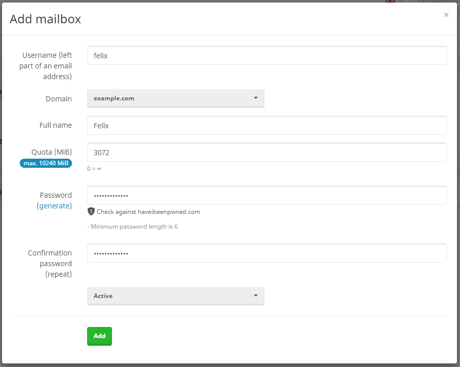

# Einführung
In diesem Tutorial erfährst du, wie du deinen eigenen Mailserver mithilfe von Mailcow aufsetzen und betreiben kannst.  
Wir verwenden hierfür [mailcow dockerized](https://github.com/mailcow/mailcow-dockerized).

Dieses Tutorial basiert auf der [Mailcow Documentation](https://mailcow.github.io/mailcow-dockerized-docs/i_u_m_install/).

# Anforderungen
- VPS mit mindestens 6 GB Ram und 20 GB Speicherplatz _(ohne E-Mails)_
- Debian 11 _(Jede von Docker CE unterstützte Distribution)_
- Eine eigene Domain _(in unserem Beispiel `example.com`)_

# Schritt 1 - Vorbereitung: Pakete und Docker
Zu Beginn aktualisieren wir die Paketlisten und installieren `git` und `curl` mit:
```
apt update && apt upgrade
apt install git curl
```

Anschließend installieren wir Docker und Docker-Compose:
```
curl -sSL https://get.docker.com/ | CHANNEL=stable sh
systemctl enable --now docker
```

```
curl -L https://github.com/docker/compose/releases/download/$(curl -Ls https://www.servercow.de/docker-compose/latest.php)/docker-compose-$(uname -s)-$(uname -m) > /usr/local/bin/docker-compose
chmod +x /usr/local/bin/docker-compose
```

# Schritt 1.1 - Vorbereitung: Domain und Hostname
Nun öffnen wir die DNS-Verwaltung unsere Domain (in diesem Beispiel verwenden wir [Cloudflare](https://www.cloudflare.com/de-de/)) und legen einen neuen `A`-Eintrag an.

Als Type wählen wir `A`,  
bei Name (Subdomain) schreiben wir `mail`,  
und bei IPv4-Adresse geben wir die IPv4-Adresse unseres Server an,  
den Proxy-Status setzen wir auf `DNS only` (deaktiviert).  

_Bei Bedarf können wir diesen Eintrag auch für unsere IPv6-Adresse wiederholen. Dafür verwenden wir den Typ `AAAA` und unsere IPv6-Adresse._  


Auf unserem Server setzen wir unsere Domain als Hostname:
```
hostname mail.example.com
echo "mail.example.com" > /etc/hostname
```

Anschließend müssen wir für unsere Server IP-Adresse noch einen rDNS/PTR-Eintrag im [Netcup Customer Control Panel](https://www.customercontrolpanel.de/?login_language=DE) setzen:  


# Schritt 2 - Klonen der Mailcow Repository
Wir wechseln in den Ordner `/opt`
```
cd /opt
```

und klonen uns hier die neuste Version von Mailcow:
```
git clone https://github.com/mailcow/mailcow-dockerized
```

# Schritt 3 - Mailcow konfigurieren
Um Mailcow zu konfigurieren, wechseln wir in das Mailcow Verzeichnis und generieren uns die `mailcow.conf`:
```
cd mailcow-dockerized
./generate_config.sh
```

Wir werden nach unserem `Mail server hostname (FQDN)` gefragt, hier geben wir unseren Hostname aus [Schritt 1.1](#schritt-11---vorbereitung-domain-und-hostname) an.


# Schritt 4 - Mailcow das erste Mal starten
Jetzt haben wir alle Basics konfiguriert und können Mailcow das erste Mal starten:
```
docker-compose pull
docker-compose up -d
```

Wir finden das Mailcow Webinterface jetzt unter `https://mail.example.com`.  
Zum Anmelden verwenden wir `admin` _(Benutzername)_ und `moohoo` _(Passwort)_.


# Schritt 4.1 - Mailcow Admin Passwort ändern
Es ist wichtig, dass du das Admin-Passwort schnellstmöglich änderst!  
Gehe auf `Zugang` und bei deinem Admin-Benutzer auf `Bearbeiten`, dort kannst du ein neues Passwort festlegen:


# Schritt 5 - Einrichten einer neuen Domain: Mailcow
Um E-Mails versenden und empfangen zu können, müssen wir die Domain in Mailcow hinzufügen.  
Dafür gehen wir im Webinterface `Konfiguration` => `E-Mail Setup` und klicken `Domain hinzufügen`:  


Dort tragen wir unsere Domain `example.com` ein und klicken `Domain hinzufügen und SOGo neustarten`.  


Um eine neue Mailbox anzulegen, gehen wir auf `Mailboxen` und klicken `Mailbox hinzufügen`:  


Hier geben wir einen `Benutzername (linker Teil der E-Mail-Adresse)` ein und setzen ein Passwort:  



# Schritt 5.1 - Einrichten einer neuen Domain: DNS
Damit wir E-Mails auch empfangen und richtig versenden können, müssen wir noch einige DNS-Einträge für die Domain anlegen.  
Dafür wechseln wir wieder in die DNS-Verwaltung unserer Domain und legen folgende Einträge an:  

**MX-Eintrag**  
Type: `MX`  
Name: `@` / `example.com`  
Mailserver / Ziel: `mail.example.com`  
Priorität: `10`  


---

**TXT-Eintrag (SPF)**  
Type: `TXT`  
Name: `@` / `example.com`  
Content: `v=spf1 +a +mx +a:mail.example.com -all`  


---

**TXT-Eintrag (dmarc)**  
Type: `TXT`  
Name: `_dmarc`  
Content: `v=DMARC1; p=none`  


---

Für den nächsten DNS-Eintrag brauchen wir weiter Informationen aus dem Mailcow Webinterface.  
Dafür gehen wir unter `Konfiguration` => `Server Konfiguration` => `Konfiguration` auf `ARC/DKIM-Keys`.  
Dort kopieren wir uns den DKIM-Public-Key unserer Domain:  


**TXT-Eintrag (dkim)**  
Type: `TXT`  
Name: `dkim._domainkey`  
Content: `<Unseren DKIM Public Key aus dem Mailcow Webinterface>`  


# Abschluss und Fazit
Super! Du hast erfolgreich deinen eigenen Mailserver mit Mailcow aufgesetzt und konfiguriert.  
Du kannst jetzt mit deiner eigenen Domains E-Mails versenden und empfangen.  

Am besten testest du das ganze einmal aus und öffnest dafür in Mailcow den Webmailclient:  

  

Zum Anmelden verwendest du deinen Benutzernamen / E-Mail und das festgelegte Passwort.  

Du kannst zum Beispiel eine E-Mail an [mail-tester.com](https://www.mail-tester.com/) senden und schauen welchen Score du erreichst. Ideal wäre hier 10/10.  


# License
MIT

# Contributor's Certificate of Origin
Contributor's Certificate of Origin By making a contribution to this project, I certify that:

 1) The contribution was created in whole or in part by me and I have the right to submit it under the license indicated in the file; or

 2) The contribution is based upon previous work that, to the best of my knowledge, is covered under an appropriate license and I have the right under that license to submit that work with modifications, whether created in whole or in part by me, under the same license (unless I am permitted to submit under a different license), as indicated in the file; or

 3) The contribution was provided directly to me by some other person who certified (a), (b) or (c) and I have not modified it.

 4) I understand and agree that this project and the contribution are public and that a record of the contribution (including all personal information I submit with it, including my sign-off) is maintained indefinitely and may be redistributed consistent with this project or the license(s) involved.

Signed-off-by: fbrettnich <github@fbrettnich.de>