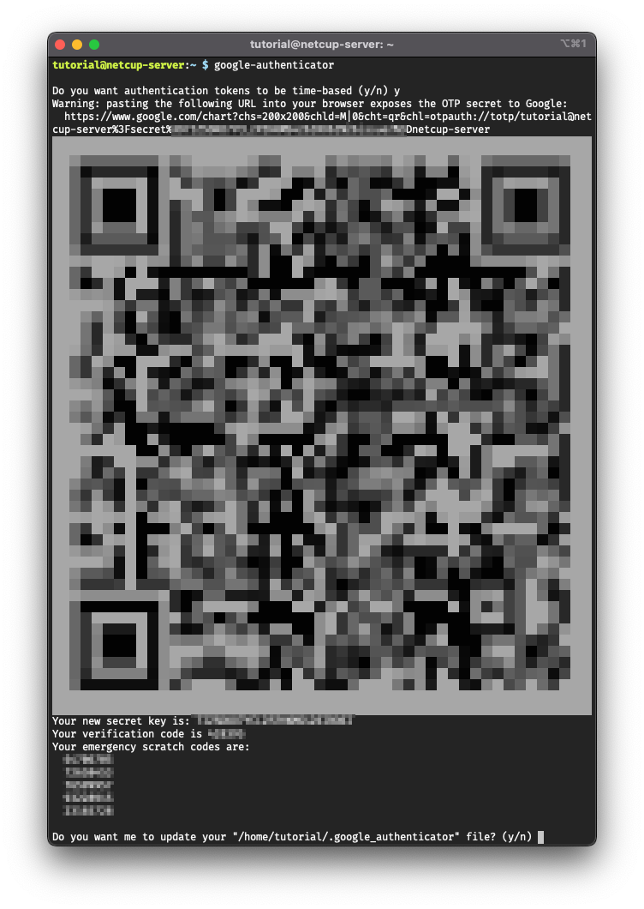
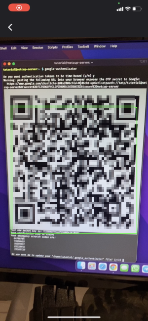
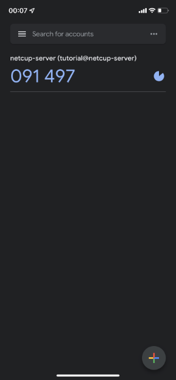

# Introduction

In this tutorial, you will learn how to easily secure your SSH login with Two-factor Authentication (2FA) using the Google Authenticator on Debian or Ubuntu Linux.

# Requirements

- netcup vServer or root server with Debian or Ubuntu Linux
- Authenticator app installed on your smartphone (e.g. Google Authenticator)

# Step 1 - Install Google Authenticator PAM module

After logging in to your server via SSH, you need to install the Google Authenticator PAM module.

Run the following commands:

```
sudo apt update
sudo apt install libpam-google-authenticator -y
```

# Step 2 - Set up 2FA for your user

Next you'll need to create a secret key and some settings and emergency codes for your user.

**This step must be repeated for each user who is to log in with 2FA.**

Run this command to start the configuration for your user:

```
google-authenticator
```

The program will ask you to answer one or more questions. In the next step, you'll see the question asked at the time of writing this tutorial (November 2021) and the answer given by the author of this tutorial.

## Step 2.1 - Set up time-based tokens

```
Do you want authentication tokens to be time-based (y/n) y
```

When you answer this question with yes (y), the secret key and some output will be generated for you:


## Step 2.2 - Scan the QR code

Now it's time to take out your phone, start the authenticator app and to add a new account. The easiest way is to scan the QR Code.

The authenticator app used in this example is the Google Authenticator app.

Select `Scan a QR Code`:


Scan the QR Code:



That's it! Now you see your newly added account:



## Step 2.3 - Write down your emergency codes

Please make sure to write down your emergency scratch codes. If you lose your phone or some other misfortune happens, you can use these emergency codes to log in to your account.

🚨 **Every code can only be used once!** 🚨

## Step 2.4 - Finish the Google Authenticator configuration

Let the program update its file inside your home directory:

```
Do you want me to update your "/home/tutorial/.google_authenticator" file? (y/n) y
```

Disallow multiple uses of the same token:

```
Do you want to disallow multiple uses of the same authentication
token? This restricts you to one login about every 30s, but it increases
your chances to notice or even prevent man-in-the-middle attacks (y/n) y
```

Disallow extra tokens for time-skew compensation:

```
By default, a new token is generated every 30 seconds by the mobile app.
In order to compensate for possible time-skew between the client and the server,
we allow an extra token before and after the current time. This allows for a
time skew of up to 30 seconds between authentication server and client. If you
experience problems with poor time synchronization, you can increase the window
from its default size of 3 permitted codes (one previous code, the current
code, the next code) to 17 permitted codes (the 8 previous codes, the current
code, and the 8 next codes). This will permit for a time skew of up to 4 minutes
between client and server.
Do you want to do so? (y/n) n
```

Enable rate limiting:

```
If the computer that you are logging into isn't hardened against brute-force
login attempts, you can enable rate-limiting for the authentication module.
By default, this limits attackers to no more than 3 login attempts every 30s.
Do you want to enable rate-limiting? (y/n) y
```

# Step 3 - Configure SSH to use Google Authenticator PAM module

The previously installed PAM module (Step 1) must be activated to ensure that the 6-digit number generated by the Authenticator app (Time-based One-time Password, TOTP) is requested when logging in via SSH.

## Step 3.1 - Edit `/etc/pam.d/sshd`

Open the file `/etc/pam.d/sshd` with `nano` editor using the following command:

```
sudo nano /etc/pam.d/sshd
```

Add the following line at the bottom of the file:

```
auth required pam_google_authenticator.so
```

Press `Ctrl + X` and then press `Y` followed by the `Enter` key to save changes.

## Step 3.2 - Edit `/etc/ssh/sshd_config`

Open the file `/etc/ssh/sshd_config` with `nano` editor using the following command:

```
sudo nano /etc/ssh/sshd_config
```

Now search for the line with `ChallengeResponseAuthentication` at the beginning and make sure it looks like this:

```
ChallengeResponseAuthentication yes
```

Press `Ctrl + X` and then press `Y` followed by the `Enter` key to save changes.

## Step 3.3 - Reload SSH server configuration

Use this command to cause the SSH server to reload its configuration:

```
sudo systemctl reload sshd.service
```

# Step 4 - Log out and log in again

Now log out and then log in to your server again via `ssh`.

Now you'll be prompted for both your password and the code of your authenticator app.

```
Password:
Verification code:
```

Enter your password and the code of your authenticator app.

Et voilà, you just logged in successfully using 2FA. 🥳

# Conclusion

You've secured your SSH logins by setting up Two-factor Authentication (2FA) **_and_** you've written down your emergency codes in a safe place.

# License

Permission is hereby granted, free of charge, to any person obtaining a copy
of this software and associated documentation files (the "Software"), to deal
in the Software without restriction, including without limitation the rights
to use, copy, modify, merge, publish, distribute, sublicence, and/or sell
copies of the Software, and to permit persons to whom the Software is
furnished to do so, subject to the following conditions:

The above copyright notice and this permission notice shall be included in all
copies or substantial portions of the Software.

THE SOFTWARE IS PROVIDED "AS IS", WITHOUT WARRANTY OF ANY KIND, EXPRESS OR
IMPLIED, INCLUDING BUT NOT LIMITED TO THE WARRANTIES OF MERCHANTABILITY,
FITNESS FOR A PARTICULAR PURPOSE AND NONINFRINGEMENT. IN NO EVENT SHALL THE
AUTHORS OR COPYRIGHT HOLDERS BE LIABLE FOR ANY CLAIM, DAMAGES OR OTHER
LIABILITY, WHETHER IN AN ACTION OF CONTRACT, TORT OR OTHERWISE, ARISING FROM,
OUT OF OR IN CONNECTION WITH THE SOFTWARE OR THE USE OR OTHER DEALINGS IN THE
SOFTWARE.

# Contributor's Certificate of Origin

By making a contribution to this project, I certify that:

1.  The contribution was created in whole or in part by me and I have the right to submit it under the license indicated in the file; or

2.  The contribution is based upon previous work that, to the best of my knowledge, is covered under an appropriate license and I have the right under that license to submit that work with modifications, whether created in whole or in part by me, under the same license (unless I am permitted to submit under a different license), as indicated in the file; or

3.  The contribution was provided directly to me by some other person who certified (a), (b) or (c) and I have not modified it.

4.  I understand and agree that this project and the contribution are public and that a record of the contribution (including all personal information I submit with it, including my sign-off) is maintained indefinitely and may be redistributed consistent with this project or the license(s) involved.

Signed off by: Michael Heinrich (michi.heinrich@gmail.com)
