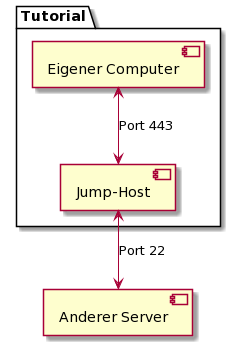

This tutorial describes the setup and usage of a simple SSH proxy, which allows to use SSH connection to own servers in environments with a blocked port 22.

This is useful when traveling, for example, if your Internet access is limited in hotels or vacation homes.

The reading time is about five minutes; implementation will take about 45 minutes.

The basic requirement for implementation is a basic understanding of the Unix command line and the use of SSH services and proxy servers. All examples have been tested on a current Debian/Ubuntu version as per October 2021, which are easy to adapt to other distributions.

The use of the proxy is also described from the Unix user's point of view. Under macOS it works similarly. For the use under Windows further adjustments are necessary, which are not part of this tutorial.

The tutorial uses the exemplary host name `v11111111.quicksrv.de`. This needs to be replaced by your own server’s name when performing the tutorial.

# Requirements
Since the presented technique is optimized to shorten deployment times from days to a few weeks, the appropriate server should:

* Be inexpensive.
* Have sufficient CPU power.
* Have a German IP address.

The hard disk capacity, on the other hand, is not relevant.

The simplest VPS from netcup fulfills these conditions completely thanks to hourly billing.

# Step 1 - (Booking the VPS)
At the time of writing this tutorial (October 2021), the [VPS 200 G8][vps200g8] is the recommended product to use as an SSH proxy.

Existing customers can easily and quickly add the product.

# Step 2 - (Basic configuration of the server)
After the provisioning of the server and the first login with the username `root` and the password sent by mail, the first step is to update the basic configuration of the server.

1. with `passwd` the root password is changed.
2. with `apt-get update && apt-get upgrade -y` you get the current security updates.
3. (optional) it is recommended to set up a SSH key at this point and to forbid password login for the root user. These procedures are not part of this tutorial. The later functionality needs root capabilities; therefore, the setup of an unprivileged user is omitted at this point.

# Step 3 (Configuration of the SSH daemon)
The SSH daemon usually listens on port 22. To make it accessible even from restricted networks, it is configured to listen also to ports 443 (HTTPS) and 80 (HTTP). These are usually not or less restricted, so there is a good chance these ports can be used to have free access to the proxy and thus to the Internet.

1. open the file `/etc/ssh/sshd_config` in an editor like `vi` or `nano`.
2. look for the line `port 22`. Probably it starts with a `#` to indicate that this is the basic configuration.
3. change the file to:
   ```
   
   port 22 
   
   port 80 
   
   port 443 
   ```
4. save and exit the editor.
5. restart the SSH daemon with `systemctl restart ssh`. The current session should remain active.
6. with `ssh -p 443 root@v111111111111.quicksrv.de` you can test the success of the configuration.
   v111111111111.quicksrv.de with your own hostname.

The SSH daemon is now successfully configured and can be reached via ports 22, 80 and 443.

# Step 4 (Use as SOCKS server)
To use Chrome or any other browser in such a way that it can handle any traffic through the SSH proxy, use it as a SOCKS proxy.

Technically, your own computer is the SOCKS proxy, which uses the SSH proxy for forwarding. Therefore, it is called

(SOCKS) proxy server is specified as `localhost` (see figure).

You start an SSH session on your own computer with the command:

`ssh -p 443 -D8080 -N root@v111111111111.quicksrv.de`. Instead of

v1111111111.quicksrv.de you must enter the correct server’s name.

Then start Chrome in a second window with the command

`google-chrome --proxy-server="socks5://localhost:8080" --host-resolver-rules="MAP * ~NOTFOUND , EXCLUDE localhost"`.

This causes Chrome to also use the SOCKS proxy as a name server for name resolution, which protects privacy.


# Step 5 (Use as jump server)
To access other servers whose SSH daemon is bound only to port 22 (or any other), use the command:

`ssh -J root@v111111111111.quicksrv.de:443 root@meinserver.de` Instead of v11111111.quicksrv.de you must enter the correct proxy server name; instead of myserver.com you must enter the server you want to connect to via the proxy.



# Conclusion
The SSH proxy can now be used. It is recommended to test both before productive use.


